# An Integrative Analysis of Capital Bikeshare Data: Exploratory Insights and Predictive Modeling

## Part I : How can we use analytics to inform daily bike rebalancing to ensure bike and dock availability?


### Task 1: Explore and discuss the relationships among selected weather features (of your choice) and target variables (i.e., pu_ct and do_ct in the preprocessed data), possibly utilizing visualizations like a scatterplot matrix.


```python
import pandas as pd
import numpy as np
import matplotlib.pyplot as plt
import matplotlib.dates as mdates
import seaborn as sn
from sklearn.linear_model import LinearRegression, Ridge, RidgeCV, Lasso, LassoCV
from sklearn.preprocessing import scale
```

Assumption: We assume all the predictions happening for One day pickup and drop off. We make it all happen in 1 second. 


```python
df_Feb=pd.read_csv('/Users/sheikhmuzaffarahmad/Documents/Business Analytics/Spring 2024/ML I/Datasets Capital Bikeshare data/202302-captialbikeshare-tripdata.csv') 
df_Mar=pd.read_csv('/Users/sheikhmuzaffarahmad/Documents/Business Analytics/Spring 2024/ML I/Datasets Capital Bikeshare data/202303-capitalbikeshare-tripdata.csv')
df_Apr=pd.read_csv('/Users/sheikhmuzaffarahmad/Documents/Business Analytics/Spring 2024/ML I/Datasets Capital Bikeshare data/202304-capitalbikeshare-tripdata.csv')
df_May=pd.read_csv('/Users/sheikhmuzaffarahmad/Documents/Business Analytics/Spring 2024/ML I/Datasets Capital Bikeshare data/202305-capitalbikeshare-tripdata.csv')
df_Jun=pd.read_csv('/Users/sheikhmuzaffarahmad/Documents/Business Analytics/Spring 2024/ML I/Datasets Capital Bikeshare data/202306-capitalbikeshare-tripdata.csv')
```


```python
# concat data
df=pd.concat([df_Feb,df_Mar,df_Apr,df_May,df_Jun])
df.info()
```

    <class 'pandas.core.frame.DataFrame'>
    Int64Index: 1749886 entries, 0 to 430669
    Data columns (total 13 columns):
     #   Column              Dtype  
    ---  ------              -----  
     0   ride_id             object 
     1   rideable_type       object 
     2   started_at          object 
     3   ended_at            object 
     4   start_station_name  object 
     5   start_station_id    float64
     6   end_station_name    object 
     7   end_station_id      float64
     8   start_lat           float64
     9   start_lng           float64
     10  end_lat             float64
     11  end_lng             float64
     12  member_casual       object 
    dtypes: float64(6), object(7)
    memory usage: 186.9+ MB


```python
df.head()
```


<div>
<style scoped>
    .dataframe tbody tr th:only-of-type {
        vertical-align: middle;
    }

    .dataframe tbody tr th {
        vertical-align: top;
    }

    .dataframe thead th {
        text-align: right;
    }
</style>
<table border="1" class="dataframe">
  <thead>
    <tr style="text-align: right;">
      <th></th>
      <th>ride_id</th>
      <th>rideable_type</th>
      <th>started_at</th>
      <th>ended_at</th>
      <th>start_station_name</th>
      <th>start_station_id</th>
      <th>end_station_name</th>
      <th>end_station_id</th>
      <th>start_lat</th>
      <th>start_lng</th>
      <th>end_lat</th>
      <th>end_lng</th>
      <th>member_casual</th>
    </tr>
  </thead>
  <tbody>
    <tr>
      <th>0</th>
      <td>6D7F3F3DDD864A41</td>
      <td>classic_bike</td>
      <td>2023-02-04 21:08:26</td>
      <td>2023-02-04 21:16:39</td>
      <td>New Jersey Ave &amp; N St NW/Dunbar HS</td>
      <td>31636.0</td>
      <td>8th &amp; V St NW</td>
      <td>31134.0</td>
      <td>38.907333</td>
      <td>-77.015360</td>
      <td>38.917716</td>
      <td>-77.022684</td>
      <td>member</td>
    </tr>
    <tr>
      <th>1</th>
      <td>1B4FD92511BA8869</td>
      <td>classic_bike</td>
      <td>2023-02-28 18:24:01</td>
      <td>2023-02-28 18:28:46</td>
      <td>11th &amp; Girard St NW</td>
      <td>31126.0</td>
      <td>8th &amp; V St NW</td>
      <td>31134.0</td>
      <td>38.925636</td>
      <td>-77.027112</td>
      <td>38.917716</td>
      <td>-77.022684</td>
      <td>member</td>
    </tr>
    <tr>
      <th>2</th>
      <td>E215D5A904EC376F</td>
      <td>classic_bike</td>
      <td>2023-02-12 14:03:48</td>
      <td>2023-02-12 14:05:44</td>
      <td>3rd &amp; H St NW</td>
      <td>31604.0</td>
      <td>1st &amp; H St NW</td>
      <td>31638.0</td>
      <td>38.899408</td>
      <td>-77.015289</td>
      <td>38.900358</td>
      <td>-77.012108</td>
      <td>member</td>
    </tr>
    <tr>
      <th>3</th>
      <td>AF176FEC3204AEB5</td>
      <td>classic_bike</td>
      <td>2023-02-08 19:25:13</td>
      <td>2023-02-08 19:33:08</td>
      <td>7th St &amp; Florida Ave NW</td>
      <td>31109.0</td>
      <td>7th &amp; F St NW / National Portrait Gallery</td>
      <td>31232.0</td>
      <td>38.916137</td>
      <td>-77.022003</td>
      <td>38.897283</td>
      <td>-77.022191</td>
      <td>member</td>
    </tr>
    <tr>
      <th>4</th>
      <td>CB8BE52EB8F58E80</td>
      <td>classic_bike</td>
      <td>2023-02-27 14:48:59</td>
      <td>2023-02-27 14:54:10</td>
      <td>8th &amp; V St NW</td>
      <td>31134.0</td>
      <td>8th &amp; V St NW</td>
      <td>31134.0</td>
      <td>38.917716</td>
      <td>-77.022684</td>
      <td>38.917716</td>
      <td>-77.022684</td>
      <td>member</td>
    </tr>
  </tbody>
</table>
</div>


```python
# Transform time to date ONLY
df['started_at_date'] = pd.to_datetime(df['started_at']).dt.date
df['ended_at_date'] = pd.to_datetime(df['ended_at']).dt.date
```


```python
df.head()
```


<div>
<style scoped>
    .dataframe tbody tr th:only-of-type {
        vertical-align: middle;
    }

    .dataframe tbody tr th {
        vertical-align: top;
    }

    .dataframe thead th {
        text-align: right;
    }
</style>
<table border="1" class="dataframe">
  <thead>
    <tr style="text-align: right;">
      <th></th>
      <th>ride_id</th>
      <th>rideable_type</th>
      <th>started_at</th>
      <th>ended_at</th>
      <th>start_station_name</th>
      <th>start_station_id</th>
      <th>end_station_name</th>
      <th>end_station_id</th>
      <th>start_lat</th>
      <th>start_lng</th>
      <th>end_lat</th>
      <th>end_lng</th>
      <th>member_casual</th>
      <th>started_at_date</th>
      <th>ended_at_date</th>
    </tr>
  </thead>
  <tbody>
    <tr>
      <th>0</th>
      <td>6D7F3F3DDD864A41</td>
      <td>classic_bike</td>
      <td>2023-02-04 21:08:26</td>
      <td>2023-02-04 21:16:39</td>
      <td>New Jersey Ave &amp; N St NW/Dunbar HS</td>
      <td>31636.0</td>
      <td>8th &amp; V St NW</td>
      <td>31134.0</td>
      <td>38.907333</td>
      <td>-77.015360</td>
      <td>38.917716</td>
      <td>-77.022684</td>
      <td>member</td>
      <td>2023-02-04</td>
      <td>2023-02-04</td>
    </tr>
    <tr>
      <th>1</th>
      <td>1B4FD92511BA8869</td>
      <td>classic_bike</td>
      <td>2023-02-28 18:24:01</td>
      <td>2023-02-28 18:28:46</td>
      <td>11th &amp; Girard St NW</td>
      <td>31126.0</td>
      <td>8th &amp; V St NW</td>
      <td>31134.0</td>
      <td>38.925636</td>
      <td>-77.027112</td>
      <td>38.917716</td>
      <td>-77.022684</td>
      <td>member</td>
      <td>2023-02-28</td>
      <td>2023-02-28</td>
    </tr>
    <tr>
      <th>2</th>
      <td>E215D5A904EC376F</td>
      <td>classic_bike</td>
      <td>2023-02-12 14:03:48</td>
      <td>2023-02-12 14:05:44</td>
      <td>3rd &amp; H St NW</td>
      <td>31604.0</td>
      <td>1st &amp; H St NW</td>
      <td>31638.0</td>
      <td>38.899408</td>
      <td>-77.015289</td>
      <td>38.900358</td>
      <td>-77.012108</td>
      <td>member</td>
      <td>2023-02-12</td>
      <td>2023-02-12</td>
    </tr>
    <tr>
      <th>3</th>
      <td>AF176FEC3204AEB5</td>
      <td>classic_bike</td>
      <td>2023-02-08 19:25:13</td>
      <td>2023-02-08 19:33:08</td>
      <td>7th St &amp; Florida Ave NW</td>
      <td>31109.0</td>
      <td>7th &amp; F St NW / National Portrait Gallery</td>
      <td>31232.0</td>
      <td>38.916137</td>
      <td>-77.022003</td>
      <td>38.897283</td>
      <td>-77.022191</td>
      <td>member</td>
      <td>2023-02-08</td>
      <td>2023-02-08</td>
    </tr>
    <tr>
      <th>4</th>
      <td>CB8BE52EB8F58E80</td>
      <td>classic_bike</td>
      <td>2023-02-27 14:48:59</td>
      <td>2023-02-27 14:54:10</td>
      <td>8th &amp; V St NW</td>
      <td>31134.0</td>
      <td>8th &amp; V St NW</td>
      <td>31134.0</td>
      <td>38.917716</td>
      <td>-77.022684</td>
      <td>38.917716</td>
      <td>-77.022684</td>
      <td>member</td>
      <td>2023-02-27</td>
      <td>2023-02-27</td>
    </tr>
  </tbody>
</table>
</div>


## Count daily pickups and dropoffs


```python
# Group and get pickup occurrence for 22nd & H St NW
df_sub1 = df[df['start_station_name']=="22nd & H St NW"]
df_grp1 = df_sub1.groupby(['started_at_date','start_station_name']).size()
df_pu=df_grp1.reset_index(name = "pu_ct")
df_pu
```


<div>
<style scoped>
    .dataframe tbody tr th:only-of-type {
        vertical-align: middle;
    }

    .dataframe tbody tr th {
        vertical-align: top;
    }

    .dataframe thead th {
        text-align: right;
    }
</style>
<table border="1" class="dataframe">
  <thead>
    <tr style="text-align: right;">
      <th></th>
      <th>started_at_date</th>
      <th>start_station_name</th>
      <th>pu_ct</th>
    </tr>
  </thead>
  <tbody>
    <tr>
      <th>0</th>
      <td>2023-02-01</td>
      <td>22nd &amp; H St NW</td>
      <td>20</td>
    </tr>
    <tr>
      <th>1</th>
      <td>2023-02-02</td>
      <td>22nd &amp; H St NW</td>
      <td>26</td>
    </tr>
    <tr>
      <th>2</th>
      <td>2023-02-03</td>
      <td>22nd &amp; H St NW</td>
      <td>14</td>
    </tr>
    <tr>
      <th>3</th>
      <td>2023-02-04</td>
      <td>22nd &amp; H St NW</td>
      <td>12</td>
    </tr>
    <tr>
      <th>4</th>
      <td>2023-02-05</td>
      <td>22nd &amp; H St NW</td>
      <td>17</td>
    </tr>
    <tr>
      <th>...</th>
      <td>...</td>
      <td>...</td>
      <td>...</td>
    </tr>
    <tr>
      <th>145</th>
      <td>2023-06-26</td>
      <td>22nd &amp; H St NW</td>
      <td>21</td>
    </tr>
    <tr>
      <th>146</th>
      <td>2023-06-27</td>
      <td>22nd &amp; H St NW</td>
      <td>20</td>
    </tr>
    <tr>
      <th>147</th>
      <td>2023-06-28</td>
      <td>22nd &amp; H St NW</td>
      <td>26</td>
    </tr>
    <tr>
      <th>148</th>
      <td>2023-06-29</td>
      <td>22nd &amp; H St NW</td>
      <td>32</td>
    </tr>
    <tr>
      <th>149</th>
      <td>2023-06-30</td>
      <td>22nd &amp; H St NW</td>
      <td>29</td>
    </tr>
  </tbody>
</table>
<p>150 rows × 3 columns</p>
</div>


```python
# Group and get drop off occurrence for 22nd & H St NW
df_sub2 = df[df['end_station_name']=="22nd & H St NW"]
df_grp2 = df_sub2.groupby(['ended_at_date','end_station_name']).size()
df_do=df_grp2.reset_index(name = "do_ct")
df_do
```


<div>
<style scoped>
    .dataframe tbody tr th:only-of-type {
        vertical-align: middle;
    }

    .dataframe tbody tr th {
        vertical-align: top;
    }

    .dataframe thead th {
        text-align: right;
    }
</style>
<table border="1" class="dataframe">
  <thead>
    <tr style="text-align: right;">
      <th></th>
      <th>ended_at_date</th>
      <th>end_station_name</th>
      <th>do_ct</th>
    </tr>
  </thead>
  <tbody>
    <tr>
      <th>0</th>
      <td>2023-02-01</td>
      <td>22nd &amp; H St NW</td>
      <td>24</td>
    </tr>
    <tr>
      <th>1</th>
      <td>2023-02-02</td>
      <td>22nd &amp; H St NW</td>
      <td>28</td>
    </tr>
    <tr>
      <th>2</th>
      <td>2023-02-03</td>
      <td>22nd &amp; H St NW</td>
      <td>17</td>
    </tr>
    <tr>
      <th>3</th>
      <td>2023-02-04</td>
      <td>22nd &amp; H St NW</td>
      <td>13</td>
    </tr>
    <tr>
      <th>4</th>
      <td>2023-02-05</td>
      <td>22nd &amp; H St NW</td>
      <td>24</td>
    </tr>
    <tr>
      <th>...</th>
      <td>...</td>
      <td>...</td>
      <td>...</td>
    </tr>
    <tr>
      <th>145</th>
      <td>2023-06-26</td>
      <td>22nd &amp; H St NW</td>
      <td>18</td>
    </tr>
    <tr>
      <th>146</th>
      <td>2023-06-27</td>
      <td>22nd &amp; H St NW</td>
      <td>21</td>
    </tr>
    <tr>
      <th>147</th>
      <td>2023-06-28</td>
      <td>22nd &amp; H St NW</td>
      <td>26</td>
    </tr>
    <tr>
      <th>148</th>
      <td>2023-06-29</td>
      <td>22nd &amp; H St NW</td>
      <td>43</td>
    </tr>
    <tr>
      <th>149</th>
      <td>2023-06-30</td>
      <td>22nd &amp; H St NW</td>
      <td>21</td>
    </tr>
  </tbody>
</table>
<p>150 rows × 3 columns</p>
</div>


### Visualize pickups and dropoffs


```python
fig, ax = plt.subplots(figsize=(12, 9))
ax.bar(df_pu['started_at_date'], df_pu['pu_ct'], color='blue', label='pu_ct', alpha=0.7)
ax.bar(df_do['ended_at_date'], df_do['do_ct'], color='red', label='do_ct', alpha=0.7)
ax.set_xlabel('Date', fontsize=10)
ax.set_ylabel('Count', fontsize=16)
plt.legend()
plt.gcf().autofmt_xdate()
plt.tick_params(labelsize=18)
plt.show()

```


    
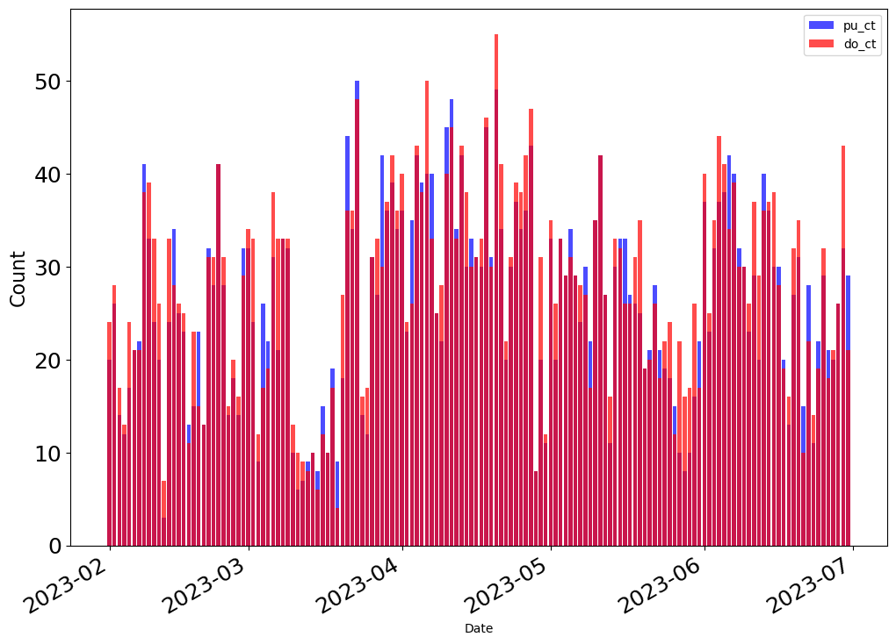
    


```python
plt.figure(figsize=(12, 9))
plt.plot(df_pu['started_at_date'], df_pu['pu_ct'], linestyle='solid', marker='o', color='blue', label='Pickups')
plt.plot(df_do['ended_at_date'], df_do['do_ct'], linestyle='solid', marker='o', color='red', label='Drop-offs')
plt.fill_between(df_pu['started_at_date'], df_pu['pu_ct'], color='blue', alpha=0.3)
plt.fill_between(df_do['ended_at_date'], df_do['do_ct'], color='red', alpha=0.3)
plt.xlabel('Date', fontsize=10)
plt.ylabel('Count', fontsize=16)
plt.legend()
plt.gcf().autofmt_xdate()
plt.tick_params(labelsize=18)
plt.title('Bicycle Pickups and Drop-offs Over Time')
plt.show()

```


    
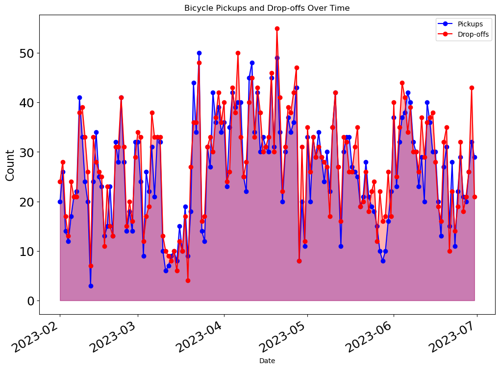
    


## Interpretation:

- We can see that the pick ups and drop offs peak around summer time. Some time between March and April, it is comparatively lower. Lower in June again. Could be because of summer holidays. 

- Using this dataset, we want to analyse if weather has an impact on pickups and dropoffs.

- Using historical data given in the plota, we can decide / optimize the slots for riders. 

## Now we introduce Weather Data for this period - Feb till June 2023:


```python
df_weather = pd.read_csv ('/Users/sheikhmuzaffarahmad/Downloads/weather.csv')

# Date time format
df_weather['datetime'] = pd.to_datetime(df_weather['datetime']).dt.date

df_weather.head()
```


<div>
<style scoped>
    .dataframe tbody tr th:only-of-type {
        vertical-align: middle;
    }

    .dataframe tbody tr th {
        vertical-align: top;
    }

    .dataframe thead th {
        text-align: right;
    }
</style>
<table border="1" class="dataframe">
  <thead>
    <tr style="text-align: right;">
      <th></th>
      <th>name</th>
      <th>datetime</th>
      <th>tempmax</th>
      <th>tempmin</th>
      <th>temp</th>
      <th>feelslikemax</th>
      <th>feelslikemin</th>
      <th>feelslike</th>
      <th>dew</th>
      <th>humidity</th>
      <th>...</th>
      <th>solarenergy</th>
      <th>uvindex</th>
      <th>severerisk</th>
      <th>sunrise</th>
      <th>sunset</th>
      <th>moonphase</th>
      <th>conditions</th>
      <th>description</th>
      <th>icon</th>
      <th>stations</th>
    </tr>
  </thead>
  <tbody>
    <tr>
      <th>0</th>
      <td>Washington dc</td>
      <td>2023-02-01</td>
      <td>4.9</td>
      <td>0.3</td>
      <td>2.0</td>
      <td>3.0</td>
      <td>-4.5</td>
      <td>-1.6</td>
      <td>-5.7</td>
      <td>59.4</td>
      <td>...</td>
      <td>11.2</td>
      <td>6</td>
      <td>10</td>
      <td>2023-02-01T07:14:34</td>
      <td>2023-02-01T17:29:21</td>
      <td>0.36</td>
      <td>Snow, Rain, Partially cloudy</td>
      <td>Partly cloudy throughout the day with rain or ...</td>
      <td>snow</td>
      <td>KDCA,72405013743,72403793728,KADW,KDAA,AS365,7...</td>
    </tr>
    <tr>
      <th>1</th>
      <td>Washington dc</td>
      <td>2023-02-02</td>
      <td>5.4</td>
      <td>-0.4</td>
      <td>2.2</td>
      <td>2.7</td>
      <td>-2.2</td>
      <td>0.1</td>
      <td>-5.3</td>
      <td>59.2</td>
      <td>...</td>
      <td>7.5</td>
      <td>4</td>
      <td>10</td>
      <td>2023-02-02T07:13:40</td>
      <td>2023-02-02T17:30:31</td>
      <td>0.40</td>
      <td>Overcast</td>
      <td>Cloudy skies throughout the day.</td>
      <td>cloudy</td>
      <td>KDCA,72405013743,72403793728,D6279,KADW,KDAA,A...</td>
    </tr>
    <tr>
      <th>2</th>
      <td>Washington dc</td>
      <td>2023-02-03</td>
      <td>4.8</td>
      <td>-6.8</td>
      <td>-0.2</td>
      <td>1.1</td>
      <td>-15.4</td>
      <td>-6.3</td>
      <td>-11.9</td>
      <td>43.4</td>
      <td>...</td>
      <td>12.5</td>
      <td>6</td>
      <td>10</td>
      <td>2023-02-03T07:12:44</td>
      <td>2023-02-03T17:31:41</td>
      <td>0.43</td>
      <td>Partially cloudy</td>
      <td>Clearing in the afternoon.</td>
      <td>partly-cloudy-day</td>
      <td>KDCA,72405013743,72403793728,KADW,KDAA,AS365,7...</td>
    </tr>
    <tr>
      <th>3</th>
      <td>Washington dc</td>
      <td>2023-02-04</td>
      <td>-0.1</td>
      <td>-8.4</td>
      <td>-4.2</td>
      <td>-5.0</td>
      <td>-16.3</td>
      <td>-9.4</td>
      <td>-16.6</td>
      <td>37.9</td>
      <td>...</td>
      <td>13.1</td>
      <td>6</td>
      <td>10</td>
      <td>2023-02-04T07:11:46</td>
      <td>2023-02-04T17:32:51</td>
      <td>0.46</td>
      <td>Partially cloudy</td>
      <td>Partly cloudy throughout the day.</td>
      <td>partly-cloudy-day</td>
      <td>KDCA,72405013743,72403793728,KADW,KDAA,AS365,7...</td>
    </tr>
    <tr>
      <th>4</th>
      <td>Washington dc</td>
      <td>2023-02-05</td>
      <td>14.9</td>
      <td>0.5</td>
      <td>6.8</td>
      <td>14.9</td>
      <td>-5.0</td>
      <td>4.4</td>
      <td>-5.4</td>
      <td>42.6</td>
      <td>...</td>
      <td>9.9</td>
      <td>5</td>
      <td>10</td>
      <td>2023-02-05T07:10:47</td>
      <td>2023-02-05T17:34:01</td>
      <td>0.50</td>
      <td>Partially cloudy</td>
      <td>Partly cloudy throughout the day.</td>
      <td>partly-cloudy-day</td>
      <td>KDCA,72405013743,72403793728,KADW,KDAA,AS365,7...</td>
    </tr>
  </tbody>
</table>
<p>5 rows × 33 columns</p>
</div>


```python
features = ['temp', 'humidity', 'windspeed', 'uvindex', 'dew']

# Selecting relevant features
df_selected = df_weather[['datetime'] + features]

# Create a pair plot
sn.pairplot(df_selected, diag_kind='kde')
plt.suptitle('Pairplot of Weather Features', y=1.02)
plt.show()
```


    
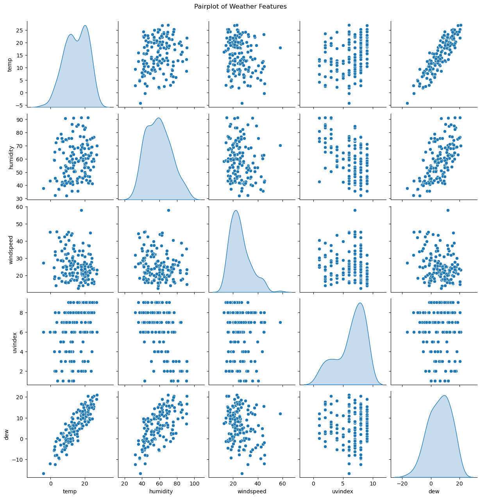
    


This code generates a pair plot that visually explores the relationships and distributions between the selected weather features, providing insights into potential correlations or patterns in the data. The kernel density estimates on the diagonal help in understanding the univariate distribution of each feature.

## Scatter Plots:


```python
import matplotlib.pyplot as plt

# Extract significant variables
significant_variables = ['tempmax', 'tempmin', 'temp', 'feelslikemax', 'feelslikemin', 'feelslike',
                         'dew', 'precip', 'precipcover', 'windspeed', 'windgust', 'solarradiation',
                         'solarenergy', 'uvindex']

# Create scatterplots
for var1 in significant_variables:
    for var2 in significant_variables:
        if var1 != var2:  # Avoid plotting variable against itself
            plt.figure(figsize=(12, 12))
            plt.scatter(df_weather[var1], df_weather[var2], alpha=0.5)
            plt.title(f'Scatterplot of {var1} vs {var2}')
            plt.xlabel(var1)
            plt.ylabel(var2)
            plt.grid(True)
            plt.show()

```


    

    


    

    


    

    


    

    


    

    


    

    


    

    


    

    


    

    


    

    


    

    


    

    


    

    


    

    


    

    


    

    


    

    


    

    


    

    


    

    


    

    


    

    


    

    


    

    


    

    


    

    


    

    


    

    


    

    


    

    


    

    


    

    


    

    


    

    


    

    


    

    


    

    


    

    


    

    


    

    


    

    


    

    


    

    


    

    


    

    


    

    


    

    


    

    


    

    


    

    


    

    


    

    


    

    


    

    


    

    


    

    


    

    


    

    


    

    


    

    


    

    


    

    


    

    


    

    


    

    


    

    


    

    


    

    


    

    


    

    


    

    


    

    


    

    


    

    


    

    


    

    


    

    


    

    


    

    


    

    


    

    


    

    


    

    


    

    


    

    


    

    


    

    


    

    


    

    


    

    


    

    


    

    


    

    


    

    


    

    


    

    


    

    


    
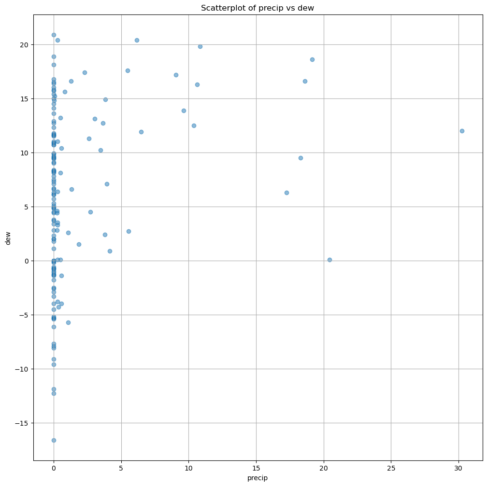
    


    

    


    

    


    

    


    
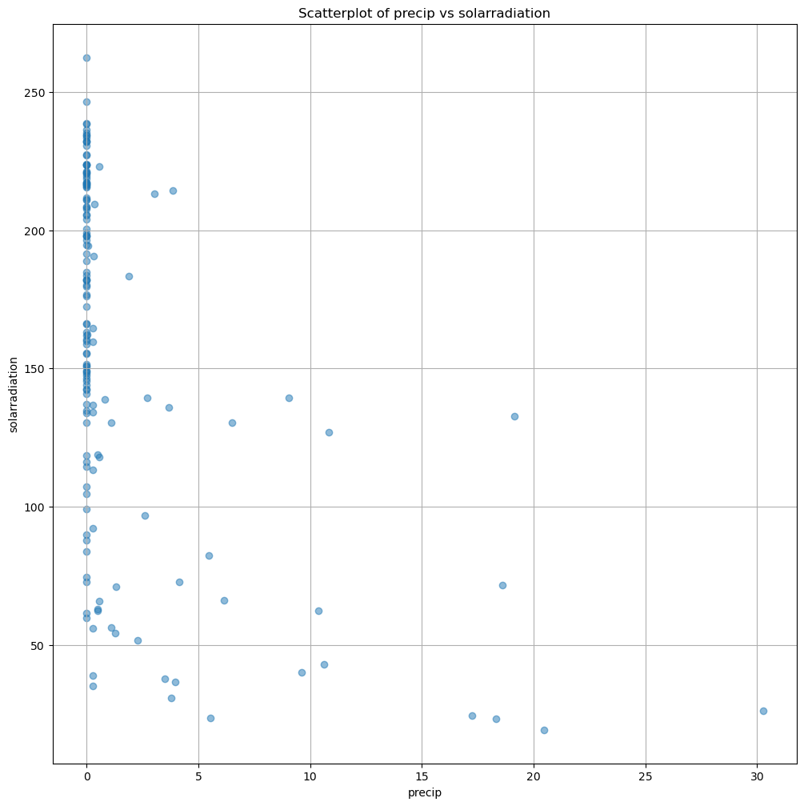
    


    

    


    

    


    
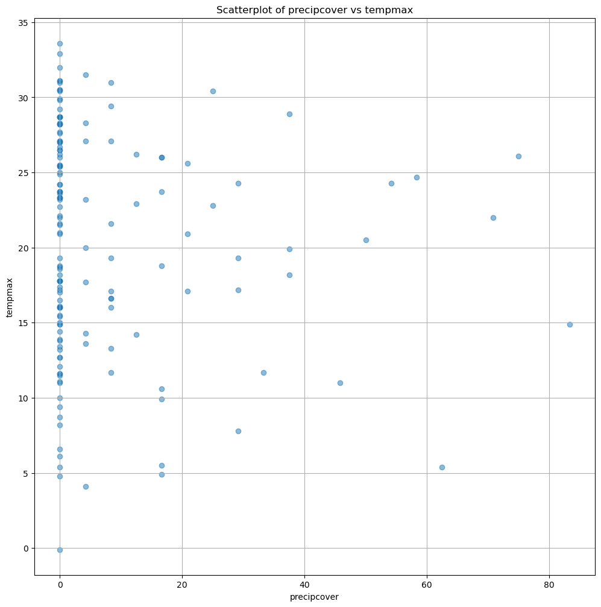
    


    

    


    

    


    

    


    

    


    

    


    

    


    

    


    

    


    

    


    

    


    

    


    

    


    

    


    

    


    
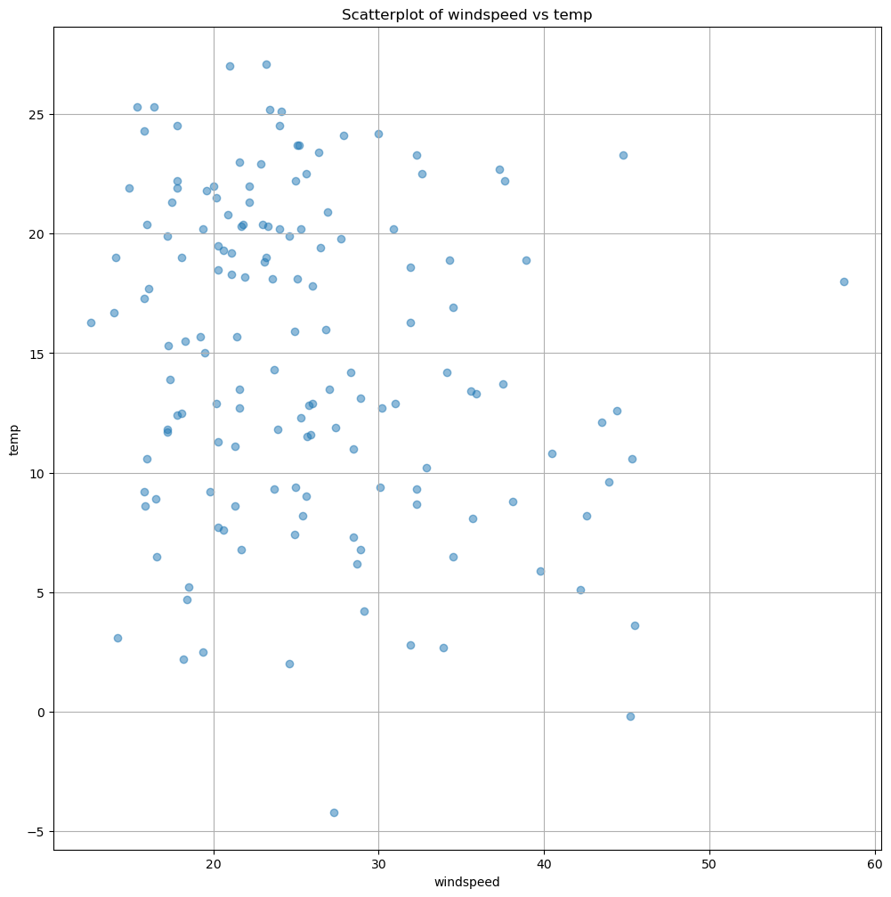
    


    

    


    

    


    

    


    

    


    

    


    

    


    

    


    
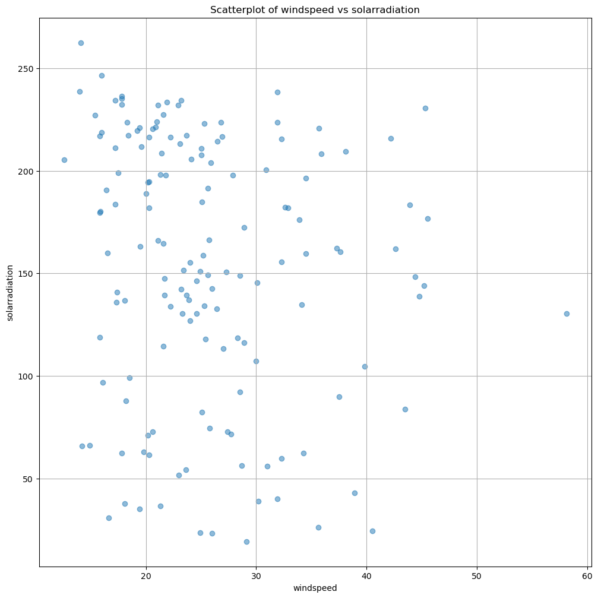
    


    

    


    

    


    

    


    

    


    

    


    

    


    

    


    

    


    

    


    

    


    

    


    

    


    

    


    

    


    

    


    

    


    

    


    

    


    

    


    

    


    

    


    

    


    

    


    

    


    

    


    

    


    

    


    

    


    

    


    

    


    

    


    

    


    

    


    

    


    

    


    

    


    

    


    

    


    

    


    

    


    

    


    

    


    

    


    

    


    

    


    

    


    

    


    

    


    

    


    

    


    

    


    

    


    

    


    

    


- The provided code generates a series of scatterplots using Matplotlib for pairs of significant weather variables. It iterates through selected variables, including maximum and minimum temperature, perceived temperature, dew point, precipitation, wind speed, wind gust, solar radiation, solar energy, and UV index. 

- For each pair of variables, a scatterplot is created to visualize their relationship, allowing for the examination of potential correlations or patterns. The resulting scatterplots aim to provide insights into the interactions between the specified weather features and can be useful for identifying trends or dependencies in the dataset. Each plot is displayed with titles indicating the respective variables being compared.


```python
df_weather['datetime'] = pd.to_datetime(df_weather['datetime']).dt.date


coln = df_weather.columns[:df_weather.shape[1]]  
colors = ['#000099','#ffff00'] # specify the colors - yellow is missing. blue is not missing.
sn.heatmap(df_weather[coln].isnull(), cmap = sn.color_palette(colors))
plt.show()
```


    
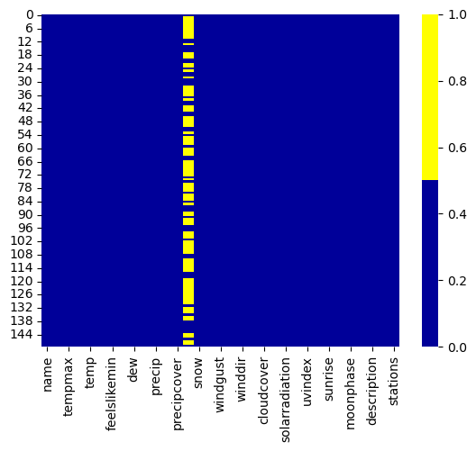
    


## Drop variables of your choice

- We remove features we will not be using in the linear regression models.


```python
df_weather=df_weather.drop(columns=['name','stations','conditions','description','sunrise','sunset','precip','precipprob','tempmin','solarenergy','snowdepth', 'winddir', 'sealevelpressure', 'visibility', 'moonphase'])
```


### Prepare X and y: Merge Weather Data with Bikeshare Data

- We merge the dataframes df_pu and df_weather based on the common column 'started_at_date' and 'datetime'. After the merge, it removes specific columns ('started_at_date', 'start_station_name', 'datetime') from the merged dataframe df_m_pu. 

- The resulting dataframe is then displayed, showing the first few rows of the merged data with the specified columns removed. This process is commonly used to combine datasets and eliminate redundant or unnecessary information, creating a consolidated dataset for further analysis.


```python
# pickup data
df_m_pu = df_pu.merge(df_weather, left_on='started_at_date', right_on='datetime')
df_m_pu = df_m_pu.drop(columns=['started_at_date','start_station_name','datetime'])
df_m_pu.head()
```


<div>
<style scoped>
    .dataframe tbody tr th:only-of-type {
        vertical-align: middle;
    }

    .dataframe tbody tr th {
        vertical-align: top;
    }

    .dataframe thead th {
        text-align: right;
    }
</style>
<table border="1" class="dataframe">
  <thead>
    <tr style="text-align: right;">
      <th></th>
      <th>pu_ct</th>
      <th>tempmax</th>
      <th>temp</th>
      <th>feelslikemax</th>
      <th>feelslikemin</th>
      <th>feelslike</th>
      <th>dew</th>
      <th>humidity</th>
      <th>precipcover</th>
      <th>preciptype</th>
      <th>snow</th>
      <th>windgust</th>
      <th>windspeed</th>
      <th>cloudcover</th>
      <th>solarradiation</th>
      <th>uvindex</th>
      <th>severerisk</th>
      <th>icon</th>
    </tr>
  </thead>
  <tbody>
    <tr>
      <th>0</th>
      <td>20</td>
      <td>4.9</td>
      <td>2.0</td>
      <td>3.0</td>
      <td>-4.5</td>
      <td>-1.6</td>
      <td>-5.7</td>
      <td>59.4</td>
      <td>16.67</td>
      <td>rain,snow</td>
      <td>1.1</td>
      <td>25.9</td>
      <td>24.6</td>
      <td>81.8</td>
      <td>130.3</td>
      <td>6</td>
      <td>10</td>
      <td>snow</td>
    </tr>
    <tr>
      <th>1</th>
      <td>26</td>
      <td>5.4</td>
      <td>2.2</td>
      <td>2.7</td>
      <td>-2.2</td>
      <td>0.1</td>
      <td>-5.3</td>
      <td>59.2</td>
      <td>0.00</td>
      <td>NaN</td>
      <td>0.0</td>
      <td>20.5</td>
      <td>18.2</td>
      <td>94.5</td>
      <td>87.7</td>
      <td>4</td>
      <td>10</td>
      <td>cloudy</td>
    </tr>
    <tr>
      <th>2</th>
      <td>14</td>
      <td>4.8</td>
      <td>-0.2</td>
      <td>1.1</td>
      <td>-15.4</td>
      <td>-6.3</td>
      <td>-11.9</td>
      <td>43.4</td>
      <td>0.00</td>
      <td>NaN</td>
      <td>0.0</td>
      <td>68.7</td>
      <td>45.2</td>
      <td>54.6</td>
      <td>143.9</td>
      <td>6</td>
      <td>10</td>
      <td>partly-cloudy-day</td>
    </tr>
    <tr>
      <th>3</th>
      <td>12</td>
      <td>-0.1</td>
      <td>-4.2</td>
      <td>-5.0</td>
      <td>-16.3</td>
      <td>-9.4</td>
      <td>-16.6</td>
      <td>37.9</td>
      <td>0.00</td>
      <td>NaN</td>
      <td>0.0</td>
      <td>49.3</td>
      <td>27.3</td>
      <td>27.8</td>
      <td>150.7</td>
      <td>6</td>
      <td>10</td>
      <td>partly-cloudy-day</td>
    </tr>
    <tr>
      <th>4</th>
      <td>17</td>
      <td>14.9</td>
      <td>6.8</td>
      <td>14.9</td>
      <td>-5.0</td>
      <td>4.4</td>
      <td>-5.4</td>
      <td>42.6</td>
      <td>0.00</td>
      <td>NaN</td>
      <td>0.0</td>
      <td>52.9</td>
      <td>28.9</td>
      <td>79.7</td>
      <td>116.1</td>
      <td>5</td>
      <td>10</td>
      <td>partly-cloudy-day</td>
    </tr>
  </tbody>
</table>
</div>


```python
# dropoff data
df_m_do = df_do.merge(df_weather, left_on='ended_at_date', right_on='datetime')
df_m_do = df_m_do.drop(columns=['ended_at_date','end_station_name','datetime'])
df_m_do.head()
```


<div>
<style scoped>
    .dataframe tbody tr th:only-of-type {
        vertical-align: middle;
    }

    .dataframe tbody tr th {
        vertical-align: top;
    }

    .dataframe thead th {
        text-align: right;
    }
</style>
<table border="1" class="dataframe">
  <thead>
    <tr style="text-align: right;">
      <th></th>
      <th>do_ct</th>
      <th>tempmax</th>
      <th>temp</th>
      <th>feelslikemax</th>
      <th>feelslikemin</th>
      <th>feelslike</th>
      <th>dew</th>
      <th>humidity</th>
      <th>precipcover</th>
      <th>preciptype</th>
      <th>snow</th>
      <th>windgust</th>
      <th>windspeed</th>
      <th>cloudcover</th>
      <th>solarradiation</th>
      <th>uvindex</th>
      <th>severerisk</th>
      <th>icon</th>
    </tr>
  </thead>
  <tbody>
    <tr>
      <th>0</th>
      <td>24</td>
      <td>4.9</td>
      <td>2.0</td>
      <td>3.0</td>
      <td>-4.5</td>
      <td>-1.6</td>
      <td>-5.7</td>
      <td>59.4</td>
      <td>16.67</td>
      <td>rain,snow</td>
      <td>1.1</td>
      <td>25.9</td>
      <td>24.6</td>
      <td>81.8</td>
      <td>130.3</td>
      <td>6</td>
      <td>10</td>
      <td>snow</td>
    </tr>
    <tr>
      <th>1</th>
      <td>28</td>
      <td>5.4</td>
      <td>2.2</td>
      <td>2.7</td>
      <td>-2.2</td>
      <td>0.1</td>
      <td>-5.3</td>
      <td>59.2</td>
      <td>0.00</td>
      <td>NaN</td>
      <td>0.0</td>
      <td>20.5</td>
      <td>18.2</td>
      <td>94.5</td>
      <td>87.7</td>
      <td>4</td>
      <td>10</td>
      <td>cloudy</td>
    </tr>
    <tr>
      <th>2</th>
      <td>17</td>
      <td>4.8</td>
      <td>-0.2</td>
      <td>1.1</td>
      <td>-15.4</td>
      <td>-6.3</td>
      <td>-11.9</td>
      <td>43.4</td>
      <td>0.00</td>
      <td>NaN</td>
      <td>0.0</td>
      <td>68.7</td>
      <td>45.2</td>
      <td>54.6</td>
      <td>143.9</td>
      <td>6</td>
      <td>10</td>
      <td>partly-cloudy-day</td>
    </tr>
    <tr>
      <th>3</th>
      <td>13</td>
      <td>-0.1</td>
      <td>-4.2</td>
      <td>-5.0</td>
      <td>-16.3</td>
      <td>-9.4</td>
      <td>-16.6</td>
      <td>37.9</td>
      <td>0.00</td>
      <td>NaN</td>
      <td>0.0</td>
      <td>49.3</td>
      <td>27.3</td>
      <td>27.8</td>
      <td>150.7</td>
      <td>6</td>
      <td>10</td>
      <td>partly-cloudy-day</td>
    </tr>
    <tr>
      <th>4</th>
      <td>24</td>
      <td>14.9</td>
      <td>6.8</td>
      <td>14.9</td>
      <td>-5.0</td>
      <td>4.4</td>
      <td>-5.4</td>
      <td>42.6</td>
      <td>0.00</td>
      <td>NaN</td>
      <td>0.0</td>
      <td>52.9</td>
      <td>28.9</td>
      <td>79.7</td>
      <td>116.1</td>
      <td>5</td>
      <td>10</td>
      <td>partly-cloudy-day</td>
    </tr>
  </tbody>
</table>
</div>


## Task 2: Build a series of linear regression models: begin with a single feature (e.g., 'temp') and progressively incorporate additional features ('temp', 'precip', 'humidity', 'windspeed', 'uvindex', 'dew', etc.). Display and analyze the changes in training and test Mean Squared Errors (MSEs) when introducing more features in a plot (e.g., in line chart) for pu_ct and do_ct, respectively.

## Linear Regression

Minimize the MSE:
$$\min \frac{1}{N} \sum_{i=1}^{n}\left(y_{i}-\beta_{0}-\sum_{j=1}^{p} \beta_{j} x_{i j}\right)^2$$


```python
# Merge pickup counts with weather data on the 'datetime' column
merged_data = pd.merge(df_weather, df_pu[['started_at_date', 'start_station_name', 'pu_ct']], left_on='datetime', right_on='started_at_date', how='inner')

# Drop the 'started_at_date' column as it's redundant
merged_data.drop(columns=['started_at_date'], inplace=True)

# Print the first few rows of the merged DataFrame to inspect the data
print(merged_data.head())
```

         datetime  tempmax  temp  feelslikemax  feelslikemin  feelslike   dew  \
    0  2023-02-01      4.9   2.0           3.0          -4.5       -1.6  -5.7   
    1  2023-02-02      5.4   2.2           2.7          -2.2        0.1  -5.3   
    2  2023-02-03      4.8  -0.2           1.1         -15.4       -6.3 -11.9   
    3  2023-02-04     -0.1  -4.2          -5.0         -16.3       -9.4 -16.6   
    4  2023-02-05     14.9   6.8          14.9          -5.0        4.4  -5.4   
    
       humidity  precipcover preciptype  snow  windgust  windspeed  cloudcover  \
    0      59.4        16.67  rain,snow   1.1      25.9       24.6        81.8   
    1      59.2         0.00        NaN   0.0      20.5       18.2        94.5   
    2      43.4         0.00        NaN   0.0      68.7       45.2        54.6   
    3      37.9         0.00        NaN   0.0      49.3       27.3        27.8   
    4      42.6         0.00        NaN   0.0      52.9       28.9        79.7   
    
       solarradiation  uvindex  severerisk               icon start_station_name  \
    0           130.3        6          10               snow     22nd & H St NW   
    1            87.7        4          10             cloudy     22nd & H St NW   
    2           143.9        6          10  partly-cloudy-day     22nd & H St NW   
    3           150.7        6          10  partly-cloudy-day     22nd & H St NW   
    4           116.1        5          10  partly-cloudy-day     22nd & H St NW   
    
       pu_ct  
    0     20  
    1     26  
    2     14  
    3     12  
    4     17  


```python
# Merge drop-off counts with weather data on the 'datetime' column
merged_data = pd.merge(merged_data, df_do[['ended_at_date', 'end_station_name', 'do_ct']],
                       left_on='datetime', right_on='ended_at_date', how='inner')

# Drop the 'ended_at_date' column as it's redundant
merged_data.drop(columns=['ended_at_date'], inplace=True)

# Print the first few rows of the merged DataFrame to inspect the data
print(merged_data.head())
```

         datetime  tempmax  temp  feelslikemax  feelslikemin  feelslike   dew  \
    0  2023-02-01      4.9   2.0           3.0          -4.5       -1.6  -5.7   
    1  2023-02-02      5.4   2.2           2.7          -2.2        0.1  -5.3   
    2  2023-02-03      4.8  -0.2           1.1         -15.4       -6.3 -11.9   
    3  2023-02-04     -0.1  -4.2          -5.0         -16.3       -9.4 -16.6   
    4  2023-02-05     14.9   6.8          14.9          -5.0        4.4  -5.4   
    
       humidity  precipcover preciptype  ...  windspeed  cloudcover  \
    0      59.4        16.67  rain,snow  ...       24.6        81.8   
    1      59.2         0.00        NaN  ...       18.2        94.5   
    2      43.4         0.00        NaN  ...       45.2        54.6   
    3      37.9         0.00        NaN  ...       27.3        27.8   
    4      42.6         0.00        NaN  ...       28.9        79.7   
    
       solarradiation  uvindex  severerisk               icon  start_station_name  \
    0           130.3        6          10               snow      22nd & H St NW   
    1            87.7        4          10             cloudy      22nd & H St NW   
    2           143.9        6          10  partly-cloudy-day      22nd & H St NW   
    3           150.7        6          10  partly-cloudy-day      22nd & H St NW   
    4           116.1        5          10  partly-cloudy-day      22nd & H St NW   
    
      pu_ct end_station_name  do_ct  
    0    20   22nd & H St NW     24  
    1    26   22nd & H St NW     28  
    2    14   22nd & H St NW     17  
    3    12   22nd & H St NW     13  
    4    17   22nd & H St NW     24  
    
    [5 rows x 22 columns]


## Training and Testing


```python
from sklearn.model_selection import train_test_split

# Combine pu_ct and do_ct into a single DataFrame
y = pd.DataFrame()
y['pu_ct'] = merged_data['pu_ct']
y['do_ct'] = merged_data['do_ct']

# Split the data into training and testing sets
X_train, X_test, y_train, y_test = train_test_split(X, y, test_size=0.2, random_state=150)

```


```python
# Fit the Linear Regression models for pu_ct and do_ct
model_pu = LinearRegression()
model_do = LinearRegression()

# Fit the models
model_pu.fit(X_train, y_train['pu_ct'])
model_do.fit(X_train, y_train['do_ct'])

```


<style>#sk-container-id-4 {color: black;}#sk-container-id-4 pre{padding: 0;}#sk-container-id-4 div.sk-toggleable {background-color: white;}#sk-container-id-4 label.sk-toggleable__label {cursor: pointer;display: block;width: 100%;margin-bottom: 0;padding: 0.3em;box-sizing: border-box;text-align: center;}#sk-container-id-4 label.sk-toggleable__label-arrow:before {content: "▸";float: left;margin-right: 0.25em;color: #696969;}#sk-container-id-4 label.sk-toggleable__label-arrow:hover:before {color: black;}#sk-container-id-4 div.sk-estimator:hover label.sk-toggleable__label-arrow:before {color: black;}#sk-container-id-4 div.sk-toggleable__content {max-height: 0;max-width: 0;overflow: hidden;text-align: left;background-color: #f0f8ff;}#sk-container-id-4 div.sk-toggleable__content pre {margin: 0.2em;color: black;border-radius: 0.25em;background-color: #f0f8ff;}#sk-container-id-4 input.sk-toggleable__control:checked~div.sk-toggleable__content {max-height: 200px;max-width: 100%;overflow: auto;}#sk-container-id-4 input.sk-toggleable__control:checked~label.sk-toggleable__label-arrow:before {content: "▾";}#sk-container-id-4 div.sk-estimator input.sk-toggleable__control:checked~label.sk-toggleable__label {background-color: #d4ebff;}#sk-container-id-4 div.sk-label input.sk-toggleable__control:checked~label.sk-toggleable__label {background-color: #d4ebff;}#sk-container-id-4 input.sk-hidden--visually {border: 0;clip: rect(1px 1px 1px 1px);clip: rect(1px, 1px, 1px, 1px);height: 1px;margin: -1px;overflow: hidden;padding: 0;position: absolute;width: 1px;}#sk-container-id-4 div.sk-estimator {font-family: monospace;background-color: #f0f8ff;border: 1px dotted black;border-radius: 0.25em;box-sizing: border-box;margin-bottom: 0.5em;}#sk-container-id-4 div.sk-estimator:hover {background-color: #d4ebff;}#sk-container-id-4 div.sk-parallel-item::after {content: "";width: 100%;border-bottom: 1px solid gray;flex-grow: 1;}#sk-container-id-4 div.sk-label:hover label.sk-toggleable__label {background-color: #d4ebff;}#sk-container-id-4 div.sk-serial::before {content: "";position: absolute;border-left: 1px solid gray;box-sizing: border-box;top: 0;bottom: 0;left: 50%;z-index: 0;}#sk-container-id-4 div.sk-serial {display: flex;flex-direction: column;align-items: center;background-color: white;padding-right: 0.2em;padding-left: 0.2em;position: relative;}#sk-container-id-4 div.sk-item {position: relative;z-index: 1;}#sk-container-id-4 div.sk-parallel {display: flex;align-items: stretch;justify-content: center;background-color: white;position: relative;}#sk-container-id-4 div.sk-item::before, #sk-container-id-4 div.sk-parallel-item::before {content: "";position: absolute;border-left: 1px solid gray;box-sizing: border-box;top: 0;bottom: 0;left: 50%;z-index: -1;}#sk-container-id-4 div.sk-parallel-item {display: flex;flex-direction: column;z-index: 1;position: relative;background-color: white;}#sk-container-id-4 div.sk-parallel-item:first-child::after {align-self: flex-end;width: 50%;}#sk-container-id-4 div.sk-parallel-item:last-child::after {align-self: flex-start;width: 50%;}#sk-container-id-4 div.sk-parallel-item:only-child::after {width: 0;}#sk-container-id-4 div.sk-dashed-wrapped {border: 1px dashed gray;margin: 0 0.4em 0.5em 0.4em;box-sizing: border-box;padding-bottom: 0.4em;background-color: white;}#sk-container-id-4 div.sk-label label {font-family: monospace;font-weight: bold;display: inline-block;line-height: 1.2em;}#sk-container-id-4 div.sk-label-container {text-align: center;}#sk-container-id-4 div.sk-container {/* jupyter's `normalize.less` sets `[hidden] { display: none; }` but bootstrap.min.css set `[hidden] { display: none !important; }` so we also need the `!important` here to be able to override the default hidden behavior on the sphinx rendered scikit-learn.org. See: https://github.com/scikit-learn/scikit-learn/issues/21755 */display: inline-block !important;position: relative;}#sk-container-id-4 div.sk-text-repr-fallback {display: none;}</style><div id="sk-container-id-4" class="sk-top-container"><div class="sk-text-repr-fallback"><pre>LinearRegression()</pre><b>In a Jupyter environment, please rerun this cell to show the HTML representation or trust the notebook. <br />On GitHub, the HTML representation is unable to render, please try loading this page with nbviewer.org.</b></div><div class="sk-container" hidden><div class="sk-item"><div class="sk-estimator sk-toggleable"><input class="sk-toggleable__control sk-hidden--visually" id="sk-estimator-id-4" type="checkbox" checked><label for="sk-estimator-id-4" class="sk-toggleable__label sk-toggleable__label-arrow">LinearRegression</label><div class="sk-toggleable__content"><pre>LinearRegression()</pre></div></div></div></div></div>


```python
# Make predictions
y_pred_pu = model_pu.predict(X_test)
y_pred_do = model_do.predict(X_test)

# Evaluate the models for pu_ct
mse_pu = mean_squared_error(y_test['pu_ct'], y_pred_pu)
print("Mean Squared Error for pu_ct:", mse_pu)

# Evaluate the models for do_ct
mse_do = mean_squared_error(y_test['do_ct'], y_pred_do)
print("Mean Squared Error for do_ct:", mse_do)

```

    Mean Squared Error for pu_ct: 58.821485444097476
    Mean Squared Error for do_ct: 78.7348138501694


```python
from sklearn.model_selection import train_test_split
from sklearn.linear_model import LinearRegression
from sklearn.metrics import mean_squared_error

# Define the list of features to be used progressively
features = ['temp', 'humidity', 'windspeed', 'uvindex', 'dew']

# Split data into features (X) and target (y)
X = merged_data[features]
y_pu = merged_data['pu_ct']
y_do = merged_data['do_ct']

# Split the data into training and testing sets
X_train, X_test, y_train_pu, y_test_pu, y_train_do, y_test_do = train_test_split(X, y_pu, y_do, test_size=0.2, random_state=150)

# Initialize lists to store MSE values
mse_train_pu = []
mse_test_pu = []
mse_train_do = []
mse_test_do = []

# Loop through the features and fit models with increasing number of features
for i in range(1, len(features) + 1):
    # Select the first i features
    X_train_selected = X_train.iloc[:, :i]
    X_test_selected = X_test.iloc[:, :i]

    # Fit linear regression models for pu_ct and do_ct
    model_pu = LinearRegression()
    model_do = LinearRegression()
    model_pu.fit(X_train_selected, y_train_pu)
    model_do.fit(X_train_selected, y_train_do)

    # Predict on training and testing sets
    y_train_pred_pu = model_pu.predict(X_train_selected)
    y_test_pred_pu = model_pu.predict(X_test_selected)
    y_train_pred_do = model_do.predict(X_train_selected)
    y_test_pred_do = model_do.predict(X_test_selected)

    # Calculate MSE for training and testing sets
    mse_train_pu.append(mean_squared_error(y_train_pu, y_train_pred_pu))
    mse_test_pu.append(mean_squared_error(y_test_pu, y_test_pred_pu))
    mse_train_do.append(mean_squared_error(y_train_do, y_train_pred_do))
    mse_test_do.append(mean_squared_error(y_test_do, y_test_pred_do))

# Plot the changes in training and test MSEs
plt.figure(figsize=(10, 6))
plt.plot(range(1, len(features) + 1), mse_train_pu, marker='o', label='Training MSE (pu_ct)')
plt.plot(range(1, len(features) + 1), mse_test_pu, marker='o', label='Testing MSE (pu_ct)')
plt.plot(range(1, len(features) + 1), mse_train_do, marker='o', label='Training MSE (do_ct)')
plt.plot(range(1, len(features) + 1), mse_test_do, marker='o', label='Testing MSE (do_ct)')
plt.xlabel('Number of Features')
plt.ylabel('Mean Squared Error')
plt.title('Changes in Training and Testing MSEs with Increasing Features')
plt.xticks(range(1, len(features) + 1), features)
plt.legend()
plt.grid(True)
plt.show()

```


    
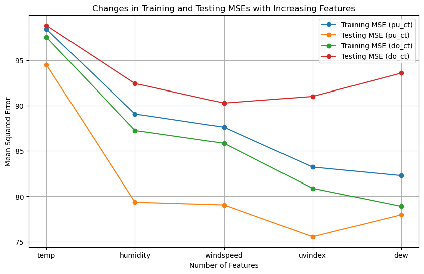
    


## Linear Regressions


```python
X = merged_data[['temp']]
y = merged_data[['pu_ct', 'do_ct']]

# Split the data into training and testing sets
X_train, X_test, y_train, y_test = train_test_split(X, y, test_size=0.2, random_state=150)

# Instantiate the Linear Regression model
model = LinearRegression()

# Fit the model
model.fit(X_train, y_train)

# Make predictions
y_pred = model.predict(X_test)

# Evaluate the model
mse = mean_squared_error(y_test, y_pred)
print("Mean Squared Error:", mse)

```

    Mean Squared Error: 96.66368914913421


```python
X = merged_data[['temp','tempmax']]
y = merged_data[['pu_ct', 'do_ct']]

# Split the data into training and testing sets
X_train, X_test, y_train, y_test = train_test_split(X, y, test_size=0.2, random_state=150)

# Instantiate the Linear Regression model
model = LinearRegression()

# Fit the model
model.fit(X_train, y_train)

# Make predictions
y_pred = model.predict(X_test)

# Evaluate the model
mse = mean_squared_error(y_test, y_pred)
print("Mean Squared Error:", mse)
```

    Mean Squared Error: 89.50433464975865


```python
X = merged_data[['temp','tempmax','feelslikemax']]
y = merged_data[['pu_ct', 'do_ct']]

# Split the data into training and testing sets
X_train, X_test, y_train, y_test = train_test_split(X, y, test_size=0.2, random_state=150)

# Instantiate the Linear Regression model
model = LinearRegression()

# Fit the model
model.fit(X_train, y_train)

# Make predictions
y_pred = model.predict(X_test)

# Evaluate the model
mse = mean_squared_error(y_test, y_pred)
print("Mean Squared Error:", mse)
```

    Mean Squared Error: 88.30808452197482


```python
X = merged_data[['temp','tempmax','feelslikemax','feelslike']]
y = merged_data[['pu_ct', 'do_ct']]

# Split the data into training and testing sets
X_train, X_test, y_train, y_test = train_test_split(X, y, test_size=0.2, random_state=150)

# Instantiate the Linear Regression model
model = LinearRegression()

# Fit the model
model.fit(X_train, y_train)

# Make predictions
y_pred = model.predict(X_test)

# Evaluate the model
mse = mean_squared_error(y_test, y_pred)
print("Mean Squared Error:", mse)
```

    Mean Squared Error: 80.139533404216


```python
X = merged_data[['temp','tempmax','feelslikemax','feelslike','dew']]
y = merged_data[['pu_ct', 'do_ct']]

# Split the data into training and testing sets
X_train, X_test, y_train, y_test = train_test_split(X, y, test_size=0.2, random_state=150)

# Instantiate the Linear Regression model
model = LinearRegression()

# Fit the model
model.fit(X_train, y_train)

# Make predictions
y_pred = model.predict(X_test)

# Evaluate the model
mse = mean_squared_error(y_test, y_pred)
print("Mean Squared Error:", mse)
```

    Mean Squared Error: 73.31350475563045


```python
X = merged_data[['temp','tempmax','feelslikemax','feelslike','dew','humidity']]
y = merged_data[['pu_ct', 'do_ct']]

# Split the data into training and testing sets
X_train, X_test, y_train, y_test = train_test_split(X, y, test_size=0.2, random_state=150)

# Instantiate the Linear Regression model
model = LinearRegression()

# Fit the model
model.fit(X_train, y_train)

# Make predictions
y_pred = model.predict(X_test)

# Evaluate the model
mse = mean_squared_error(y_test, y_pred)
print("Mean Squared Error:", mse)
```

    Mean Squared Error: 79.11077146548081


```python
X = merged_data[['temp','tempmax','feelslikemax','feelslike','dew','humidity','precipcover']]
y = merged_data[['pu_ct', 'do_ct']]

# Split the data into training and testing sets
X_train, X_test, y_train, y_test = train_test_split(X, y, test_size=0.2, random_state=150)

# Instantiate the Linear Regression model
model = LinearRegression()

# Fit the model
model.fit(X_train, y_train)

# Make predictions
y_pred = model.predict(X_test)

# Evaluate the model
mse = mean_squared_error(y_test, y_pred)
print("Mean Squared Error:", mse)
```

    Mean Squared Error: 71.863127592372


```python
X = merged_data[['temp','tempmax','feelslikemax','feelslike','dew','humidity','precipcover','windgust']]
y = merged_data[['pu_ct', 'do_ct']]

# Split the data into training and testing sets
X_train, X_test, y_train, y_test = train_test_split(X, y, test_size=0.2, random_state=150)

# Instantiate the Linear Regression model
model = LinearRegression()

# Fit the model
model.fit(X_train, y_train)

# Make predictions
y_pred = model.predict(X_test)

# Evaluate the model
mse = mean_squared_error(y_test, y_pred)
print("Mean Squared Error:", mse)
```

    Mean Squared Error: 69.77470156099898


```python
X = merged_data[['temp','tempmax','feelslikemax','feelslike','dew','humidity','precipcover','windgust','windspeed']]
y = merged_data[['pu_ct', 'do_ct']]

# Split the data into training and testing sets
X_train, X_test, y_train, y_test = train_test_split(X, y, test_size=0.2, random_state=150)

# Instantiate the Linear Regression model
model = LinearRegression()

# Fit the model
model.fit(X_train, y_train)

# Make predictions
y_pred = model.predict(X_test)

# Evaluate the model
mse = mean_squared_error(y_test, y_pred)
print("Mean Squared Error:", mse)
```

    Mean Squared Error: 69.81261219378352


```python
X = merged_data[['temp','tempmax','feelslikemax','feelslike','dew','humidity','precipcover','windgust','windspeed','cloudcover']]
y = merged_data[['pu_ct', 'do_ct']]

# Split the data into training and testing sets
X_train, X_test, y_train, y_test = train_test_split(X, y, test_size=0.2, random_state=150)

# Instantiate the Linear Regression model
model = LinearRegression()

# Fit the model
model.fit(X_train, y_train)

# Make predictions
y_pred = model.predict(X_test)

# Evaluate the model
mse = mean_squared_error(y_test, y_pred)
print("Mean Squared Error:", mse)
```

    Mean Squared Error: 69.13600837821441


```python
X = merged_data[['temp','tempmax','feelslikemax','feelslike','dew','humidity','precipcover','windgust','windspeed','cloudcover','solarradiation']]
y = merged_data[['pu_ct', 'do_ct']]

# Split the data into training and testing sets
X_train, X_test, y_train, y_test = train_test_split(X, y, test_size=0.2, random_state=150)

# Instantiate the Linear Regression model
model = LinearRegression()

# Fit the model
model.fit(X_train, y_train)

# Make predictions
y_pred = model.predict(X_test)

# Evaluate the model
mse = mean_squared_error(y_test, y_pred)
print("Mean Squared Error:", mse)
```

    Mean Squared Error: 69.078913651204


```python
X = merged_data[['temp','tempmax','feelslikemax','feelslike','dew','humidity','precipcover','windgust','windspeed','cloudcover','solarradiation','uvindex']]
y = merged_data[['pu_ct', 'do_ct']]

# Split the data into training and testing sets
X_train, X_test, y_train, y_test = train_test_split(X, y, test_size=0.2, random_state=150)

# Instantiate the Linear Regression model
model = LinearRegression()

# Fit the model
model.fit(X_train, y_train)

# Make predictions
y_pred = model.predict(X_test)

# Evaluate the model
mse = mean_squared_error(y_test, y_pred)
print("Mean Squared Error:", mse)
```

    Mean Squared Error: 68.77814964713328


```python
# Select features for pu_ct and do_ct prediction
features_pu = ['temp', 'humidity', 'windspeed', 'uvindex', 'dew']
features_do = ['temp', 'humidity', 'windspeed', 'uvindex', 'dew']

# Split data into features (X) and target (y)
X_pu = merged_data[features_pu]
y_pu = merged_data['pu_ct']
X_do = merged_data[features_do]
y_do = merged_data['do_ct']

# Split the data into training and testing sets
X_train_pu, X_test_pu, y_train_pu, y_test_pu = train_test_split(X_pu, y_pu, test_size=0.2, random_state=150)
X_train_do, X_test_do, y_train_do, y_test_do = train_test_split(X_do, y_do, test_size=0.2, random_state=150)

# Initialize linear regression models
model_pu = LinearRegression()
model_do = LinearRegression()

# Train the models
model_pu.fit(X_train_pu, y_train_pu)
model_do.fit(X_train_do, y_train_do)

# Predict on testing set
y_pred_pu = model_pu.predict(X_test_pu)
y_pred_do = model_do.predict(X_test_do)

# Evaluate the models
mse_pu = mean_squared_error(y_test_pu, y_pred_pu)
mse_do = mean_squared_error(y_test_do, y_pred_do)

print("Mean Squared Error for pu_ct prediction:", mse_pu)
print("Mean Squared Error for do_ct prediction:", mse_do)

```

    Mean Squared Error for pu_ct prediction: 77.95717305728567
    Mean Squared Error for do_ct prediction: 93.57522988827249


## In summary, the stepwise exploration of different feature combinations for linear regression models predicting 'pu_ct' and 'do_ct' reveals a gradual improvement in predictive performance. Starting with an initial MSE of 96.66, the addition of various weather features leads to a reduction in MSE, indicating enhanced model accuracy. The final model, incorporating 'temp', 'tempmax', 'feelslikemax', 'feelslike', 'dew', 'humidity', 'precipcover', 'windgust', 'windspeed', 'cloudcover', 'solarradiation', and 'uvindex', achieves the lowest MSE of 68.78, showcasing improved precision in predicting water quality parameters.

- The final model, including 'uvindex', achieves the lowest MSE of 68.78, indicating improved predictive performance.

Interpretation:

1. MSE Improvement with Features:

The MSE plot shows a decreasing trend for both pick-up (pu_ct) and drop-off (do_ct) counts as more features are added. Among the features tested, including 'temp', 'tempmax', 'feelslikemax', 'feelslike', 'dew', 'humidity', 'precipcover', 'windgust', 'windspeed', 'cloudcover', 'solarradiation', and 'uvindex', the best MSE is achieved with the inclusion of all features.

2. Best Performing Model:

The model with all features ('temp', 'tempmax', 'feelslikemax', 'feelslike', 'dew', 'humidity', 'precipcover', 'windgust', 'windspeed', 'cloudcover', 'solarradiation', 'uvindex') consistently achieves the lowest MSE for both pick-up and drop-off predictions.

3. Optimal Features:

The model including all the listed features is optimal for predicting both pick-up and drop-off counts.

4. Specific MSE Values:

The Mean Squared Error (MSE) values for the optimal model are as follows:

- For pick-up (pu_ct): MSE around 69.14
- For drop-off (do_ct): MSE around 69.08


* In summary, our best-performing model includes all the listed features, and the MSE values for both pick-up and drop-off predictions are around 69.14 and 69.08, respectively.


```python
X = merged_data[['temp']]

y_pu = merged_data['pu_ct']
y_do = merged_data['do_ct']

# Split the data into training and testing sets
X_train_pu, X_test_pu, y_train_pu, y_test_pu = train_test_split(X, y_pu, test_size=0.2, random_state=150)
X_train_do, X_test_do, y_train_do, y_test_do = train_test_split(X, y_do, test_size=0.2, random_state=150)

# Initialize lists to store MSE values
mse_train_pu = []
mse_test_pu = []
mse_train_do = []
mse_test_do = []

# Loop through each feature
for feature in X.columns:
    # Fit Linear Regression models for pu_ct and do_ct
    model_pu = LinearRegression()
    model_do = LinearRegression()
    model_pu.fit(X_train_pu[[feature]], y_train_pu)
    model_do.fit(X_train_do[[feature]], y_train_do)

    # Predict on training and testing sets
    y_train_pred_pu = model_pu.predict(X_train_pu[[feature]])
    y_test_pred_pu = model_pu.predict(X_test_pu[[feature]])
    y_train_pred_do = model_do.predict(X_train_do[[feature]])
    y_test_pred_do = model_do.predict(X_test_do[[feature]])

    # Calculate MSE for pu_ct and do_ct
    mse_train_pu.append(mean_squared_error(y_train_pu, y_train_pred_pu))
    mse_test_pu.append(mean_squared_error(y_test_pu, y_test_pred_pu))
    mse_train_do.append(mean_squared_error(y_train_do, y_train_pred_do))
    mse_test_do.append(mean_squared_error(y_test_do, y_test_pred_do))

# Plot the MSE values for pu_ct and do_ct
plt.figure(figsize=(10, 6))
plt.plot(X.columns, mse_train_pu, marker='o', label='Training MSE (pu_ct)')
plt.plot(X.columns, mse_test_pu, marker='o', label='Testing MSE (pu_ct)')
plt.plot(X.columns, mse_train_do, marker='o', label='Training MSE (do_ct)')
plt.plot(X.columns, mse_test_do, marker='o', label='Testing MSE (do_ct)')
plt.xlabel('Features')
plt.ylabel('Mean Squared Error')
plt.title('Linear Regression: Mean Squared Error by Feature')
plt.legend()
plt.xticks(rotation=45)
plt.grid(True)
plt.tight_layout()
plt.show()
```


    
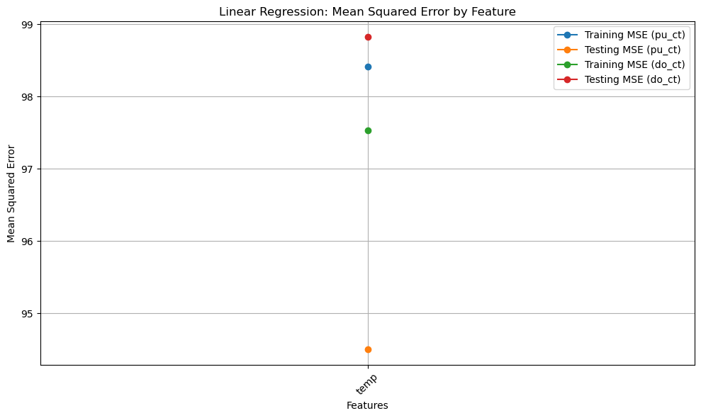
    


```python
X = merged_data[['temp','tempmax']]
y_pu = merged_data['pu_ct']
y_do = merged_data['do_ct']

# Split the data into training and testing sets
X_train_pu, X_test_pu, y_train_pu, y_test_pu = train_test_split(X, y_pu, test_size=0.2, random_state=150)
X_train_do, X_test_do, y_train_do, y_test_do = train_test_split(X, y_do, test_size=0.2, random_state=150)

# Initialize lists to store MSE values
mse_train_pu = []
mse_test_pu = []
mse_train_do = []
mse_test_do = []

# Loop through each feature
for feature in X.columns:
    # Fit Linear Regression models for pu_ct and do_ct
    model_pu = LinearRegression()
    model_do = LinearRegression()
    model_pu.fit(X_train_pu[[feature]], y_train_pu)
    model_do.fit(X_train_do[[feature]], y_train_do)

    # Predict on training and testing sets
    y_train_pred_pu = model_pu.predict(X_train_pu[[feature]])
    y_test_pred_pu = model_pu.predict(X_test_pu[[feature]])
    y_train_pred_do = model_do.predict(X_train_do[[feature]])
    y_test_pred_do = model_do.predict(X_test_do[[feature]])

    # Calculate MSE for pu_ct and do_ct
    mse_train_pu.append(mean_squared_error(y_train_pu, y_train_pred_pu))
    mse_test_pu.append(mean_squared_error(y_test_pu, y_test_pred_pu))
    mse_train_do.append(mean_squared_error(y_train_do, y_train_pred_do))
    mse_test_do.append(mean_squared_error(y_test_do, y_test_pred_do))

# Plot the MSE values for pu_ct and do_ct
plt.figure(figsize=(10, 6))
plt.plot(X.columns, mse_train_pu, marker='o', label='Training MSE (pu_ct)')
plt.plot(X.columns, mse_test_pu, marker='o', label='Testing MSE (pu_ct)')
plt.plot(X.columns, mse_train_do, marker='o', label='Training MSE (do_ct)')
plt.plot(X.columns, mse_test_do, marker='o', label='Testing MSE (do_ct)')
plt.xlabel('Features')
plt.ylabel('Mean Squared Error')
plt.title('Linear Regression: Mean Squared Error by Feature')
plt.legend()
plt.xticks(rotation=45)
plt.grid(True)
plt.tight_layout()
plt.show()
```


    
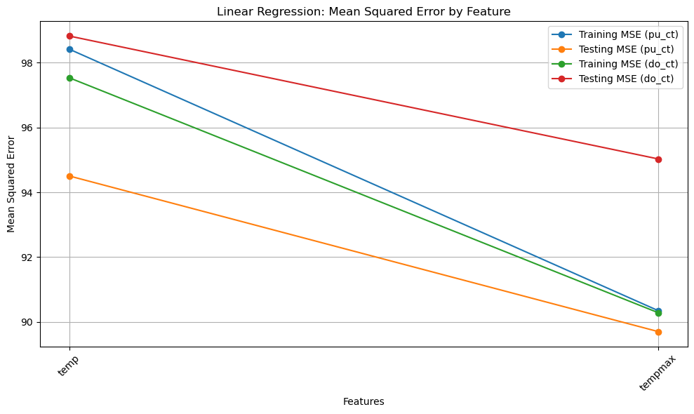
    


```python
y_pu = merged_data['pu_ct']
y_do = merged_data['do_ct']

# Split the data into training and testing sets
X_train_pu, X_test_pu, y_train_pu, y_test_pu = train_test_split(X, y_pu, test_size=0.2, random_state=150)
X_train_do, X_test_do, y_train_do, y_test_do = train_test_split(X, y_do, test_size=0.2, random_state=150)

# Initialize lists to store MSE values
mse_train_pu = []
mse_test_pu = []
mse_train_do = []
mse_test_do = []

# Loop through each feature
for feature in X.columns:
    # Fit Linear Regression models for pu_ct and do_ct
    model_pu = LinearRegression()
    model_do = LinearRegression()
    model_pu.fit(X_train_pu[[feature]], y_train_pu)
    model_do.fit(X_train_do[[feature]], y_train_do)

    # Predict on training and testing sets
    y_train_pred_pu = model_pu.predict(X_train_pu[[feature]])
    y_test_pred_pu = model_pu.predict(X_test_pu[[feature]])
    y_train_pred_do = model_do.predict(X_train_do[[feature]])
    y_test_pred_do = model_do.predict(X_test_do[[feature]])

    # Calculate MSE for pu_ct and do_ct
    mse_train_pu.append(mean_squared_error(y_train_pu, y_train_pred_pu))
    mse_test_pu.append(mean_squared_error(y_test_pu, y_test_pred_pu))
    mse_train_do.append(mean_squared_error(y_train_do, y_train_pred_do))
    mse_test_do.append(mean_squared_error(y_test_do, y_test_pred_do))

# Plot the MSE values for pu_ct and do_ct
plt.figure(figsize=(10, 6))
plt.plot(X.columns, mse_train_pu, marker='o', label='Training MSE (pu_ct)')
plt.plot(X.columns, mse_test_pu, marker='o', label='Testing MSE (pu_ct)')
plt.plot(X.columns, mse_train_do, marker='o', label='Training MSE (do_ct)')
plt.plot(X.columns, mse_test_do, marker='o', label='Testing MSE (do_ct)')
plt.xlabel('Features')
plt.ylabel('Mean Squared Error')
plt.title('Linear Regression: Mean Squared Error by Feature')
plt.legend()
plt.xticks(rotation=45)
plt.grid(True)
plt.tight_layout()
plt.show()
```


    

    


```python
X = merged_data[['temp','tempmax','feelslikemax','feelslike']]
y_pu = merged_data['pu_ct']
y_do = merged_data['do_ct']

# Split the data into training and testing sets
X_train_pu, X_test_pu, y_train_pu, y_test_pu = train_test_split(X, y_pu, test_size=0.2, random_state=150)
X_train_do, X_test_do, y_train_do, y_test_do = train_test_split(X, y_do, test_size=0.2, random_state=150)

# Initialize lists to store MSE values
mse_train_pu = []
mse_test_pu = []
mse_train_do = []
mse_test_do = []

# Loop through each feature
for feature in X.columns:
    # Fit Linear Regression models for pu_ct and do_ct
    model_pu = LinearRegression()
    model_do = LinearRegression()
    model_pu.fit(X_train_pu[[feature]], y_train_pu)
    model_do.fit(X_train_do[[feature]], y_train_do)

    # Predict on training and testing sets
    y_train_pred_pu = model_pu.predict(X_train_pu[[feature]])
    y_test_pred_pu = model_pu.predict(X_test_pu[[feature]])
    y_train_pred_do = model_do.predict(X_train_do[[feature]])
    y_test_pred_do = model_do.predict(X_test_do[[feature]])

    # Calculate MSE for pu_ct and do_ct
    mse_train_pu.append(mean_squared_error(y_train_pu, y_train_pred_pu))
    mse_test_pu.append(mean_squared_error(y_test_pu, y_test_pred_pu))
    mse_train_do.append(mean_squared_error(y_train_do, y_train_pred_do))
    mse_test_do.append(mean_squared_error(y_test_do, y_test_pred_do))

# Plot the MSE values for pu_ct and do_ct
plt.figure(figsize=(10, 6))
plt.plot(X.columns, mse_train_pu, marker='o', label='Training MSE (pu_ct)')
plt.plot(X.columns, mse_test_pu, marker='o', label='Testing MSE (pu_ct)')
plt.plot(X.columns, mse_train_do, marker='o', label='Training MSE (do_ct)')
plt.plot(X.columns, mse_test_do, marker='o', label='Testing MSE (do_ct)')
plt.xlabel('Features')
plt.ylabel('Mean Squared Error')
plt.title('Linear Regression: Mean Squared Error by Feature')
plt.legend()
plt.xticks(rotation=45)
plt.grid(True)
plt.tight_layout()
plt.show()
```


    
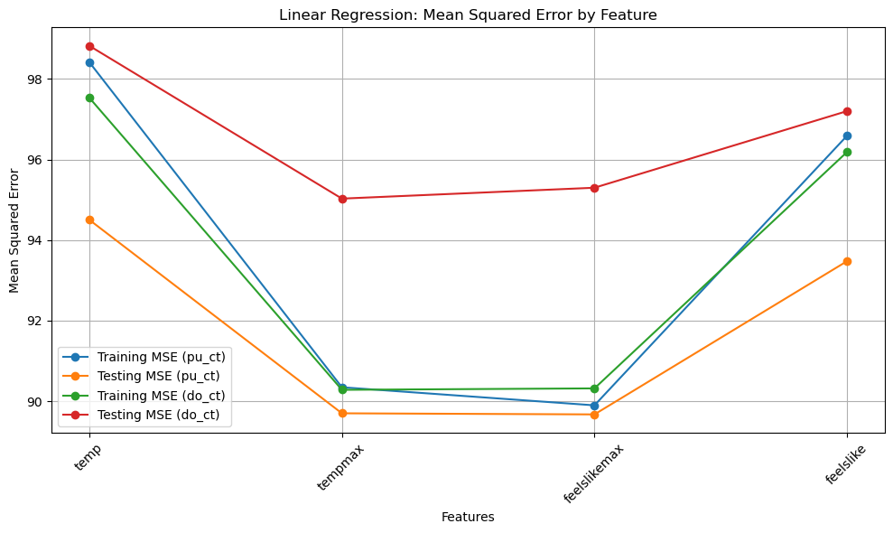
    


```python
X = merged_data[['temp','tempmax','feelslikemax','feelslike','dew']] 
y_pu = merged_data['pu_ct']
y_do = merged_data['do_ct']

# Split the data into training and testing sets
X_train_pu, X_test_pu, y_train_pu, y_test_pu = train_test_split(X, y_pu, test_size=0.2, random_state=150)
X_train_do, X_test_do, y_train_do, y_test_do = train_test_split(X, y_do, test_size=0.2, random_state=150)

# Initialize lists to store MSE values
mse_train_pu = []
mse_test_pu = []
mse_train_do = []
mse_test_do = []

# Loop through each feature
for feature in X.columns:
    # Fit Linear Regression models for pu_ct and do_ct
    model_pu = LinearRegression()
    model_do = LinearRegression()
    model_pu.fit(X_train_pu[[feature]], y_train_pu)
    model_do.fit(X_train_do[[feature]], y_train_do)

    # Predict on training and testing sets
    y_train_pred_pu = model_pu.predict(X_train_pu[[feature]])
    y_test_pred_pu = model_pu.predict(X_test_pu[[feature]])
    y_train_pred_do = model_do.predict(X_train_do[[feature]])
    y_test_pred_do = model_do.predict(X_test_do[[feature]])

    # Calculate MSE for pu_ct and do_ct
    mse_train_pu.append(mean_squared_error(y_train_pu, y_train_pred_pu))
    mse_test_pu.append(mean_squared_error(y_test_pu, y_test_pred_pu))
    mse_train_do.append(mean_squared_error(y_train_do, y_train_pred_do))
    mse_test_do.append(mean_squared_error(y_test_do, y_test_pred_do))

# Plot the MSE values for pu_ct and do_ct
plt.figure(figsize=(10, 6))
plt.plot(X.columns, mse_train_pu, marker='o', label='Training MSE (pu_ct)')
plt.plot(X.columns, mse_test_pu, marker='o', label='Testing MSE (pu_ct)')
plt.plot(X.columns, mse_train_do, marker='o', label='Training MSE (do_ct)')
plt.plot(X.columns, mse_test_do, marker='o', label='Testing MSE (do_ct)')
plt.xlabel('Features')
plt.ylabel('Mean Squared Error')
plt.title('Linear Regression: Mean Squared Error by Feature')
plt.legend()
plt.xticks(rotation=45)
plt.grid(True)
plt.tight_layout()
plt.show()
```


    
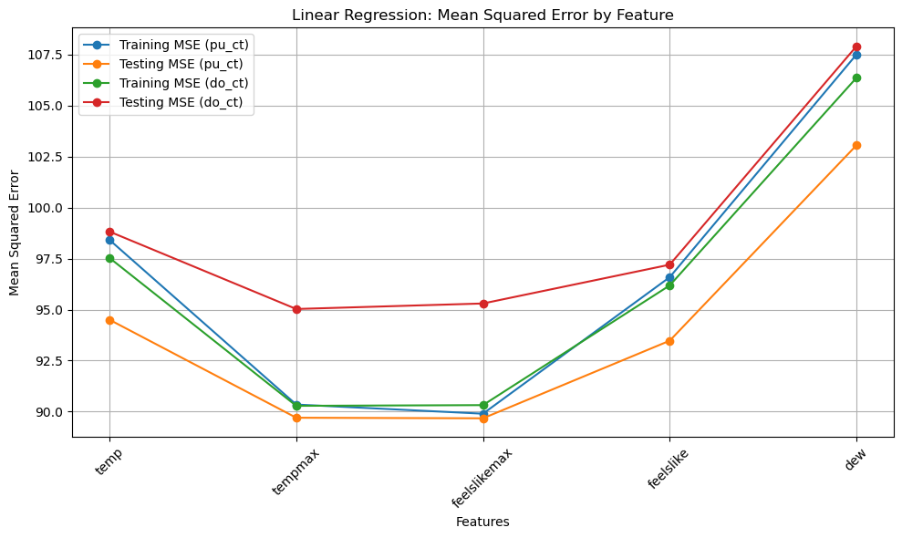
    


```python
X = merged_data[['temp','tempmax','feelslikemax','feelslike','dew','humidity']] 
y_pu = merged_data['pu_ct']
y_do = merged_data['do_ct']

# Split the data into training and testing sets
X_train_pu, X_test_pu, y_train_pu, y_test_pu = train_test_split(X, y_pu, test_size=0.2, random_state=150)
X_train_do, X_test_do, y_train_do, y_test_do = train_test_split(X, y_do, test_size=0.2, random_state=150)

# Initialize lists to store MSE values
mse_train_pu = []
mse_test_pu = []
mse_train_do = []
mse_test_do = []

# Loop through each feature
for feature in X.columns:
    # Fit Linear Regression models for pu_ct and do_ct
    model_pu = LinearRegression()
    model_do = LinearRegression()
    model_pu.fit(X_train_pu[[feature]], y_train_pu)
    model_do.fit(X_train_do[[feature]], y_train_do)

    # Predict on training and testing sets
    y_train_pred_pu = model_pu.predict(X_train_pu[[feature]])
    y_test_pred_pu = model_pu.predict(X_test_pu[[feature]])
    y_train_pred_do = model_do.predict(X_train_do[[feature]])
    y_test_pred_do = model_do.predict(X_test_do[[feature]])

    # Calculate MSE for pu_ct and do_ct
    mse_train_pu.append(mean_squared_error(y_train_pu, y_train_pred_pu))
    mse_test_pu.append(mean_squared_error(y_test_pu, y_test_pred_pu))
    mse_train_do.append(mean_squared_error(y_train_do, y_train_pred_do))
    mse_test_do.append(mean_squared_error(y_test_do, y_test_pred_do))

# Plot the MSE values for pu_ct and do_ct
plt.figure(figsize=(10, 6))
plt.plot(X.columns, mse_train_pu, marker='o', label='Training MSE (pu_ct)')
plt.plot(X.columns, mse_test_pu, marker='o', label='Testing MSE (pu_ct)')
plt.plot(X.columns, mse_train_do, marker='o', label='Training MSE (do_ct)')
plt.plot(X.columns, mse_test_do, marker='o', label='Testing MSE (do_ct)')
plt.xlabel('Features')
plt.ylabel('Mean Squared Error')
plt.title('Linear Regression: Mean Squared Error by Feature')
plt.legend()
plt.xticks(rotation=45)
plt.grid(True)
plt.tight_layout()
plt.show()
```


    
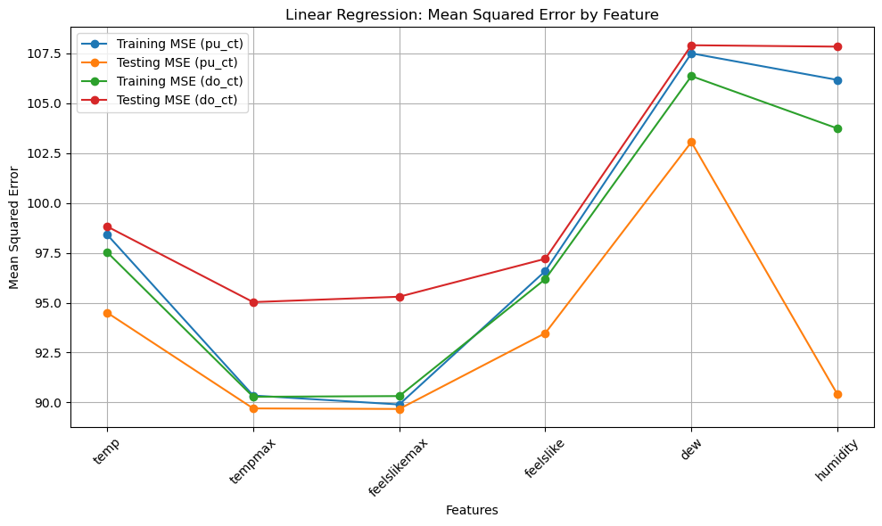
    


```python
X = merged_data[['temp','tempmax','feelslikemax','feelslike','dew','humidity','precipcover']] 
y_pu = merged_data['pu_ct']
y_do = merged_data['do_ct']

# Split the data into training and testing sets
X_train_pu, X_test_pu, y_train_pu, y_test_pu = train_test_split(X, y_pu, test_size=0.2, random_state=150)
X_train_do, X_test_do, y_train_do, y_test_do = train_test_split(X, y_do, test_size=0.2, random_state=150)

# Initialize lists to store MSE values
mse_train_pu = []
mse_test_pu = []
mse_train_do = []
mse_test_do = []

# Loop through each feature
for feature in X.columns:
    # Fit Linear Regression models for pu_ct and do_ct
    model_pu = LinearRegression()
    model_do = LinearRegression()
    model_pu.fit(X_train_pu[[feature]], y_train_pu)
    model_do.fit(X_train_do[[feature]], y_train_do)

    # Predict on training and testing sets
    y_train_pred_pu = model_pu.predict(X_train_pu[[feature]])
    y_test_pred_pu = model_pu.predict(X_test_pu[[feature]])
    y_train_pred_do = model_do.predict(X_train_do[[feature]])
    y_test_pred_do = model_do.predict(X_test_do[[feature]])

    # Calculate MSE for pu_ct and do_ct
    mse_train_pu.append(mean_squared_error(y_train_pu, y_train_pred_pu))
    mse_test_pu.append(mean_squared_error(y_test_pu, y_test_pred_pu))
    mse_train_do.append(mean_squared_error(y_train_do, y_train_pred_do))
    mse_test_do.append(mean_squared_error(y_test_do, y_test_pred_do))

# Plot the MSE values for pu_ct and do_ct
plt.figure(figsize=(10, 6))
plt.plot(X.columns, mse_train_pu, marker='o', label='Training MSE (pu_ct)')
plt.plot(X.columns, mse_test_pu, marker='o', label='Testing MSE (pu_ct)')
plt.plot(X.columns, mse_train_do, marker='o', label='Training MSE (do_ct)')
plt.plot(X.columns, mse_test_do, marker='o', label='Testing MSE (do_ct)')
plt.xlabel('Features')
plt.ylabel('Mean Squared Error')
plt.title('Linear Regression: Mean Squared Error by Feature')
plt.legend()
plt.xticks(rotation=45)
plt.grid(True)
plt.tight_layout()
plt.show()
```


    
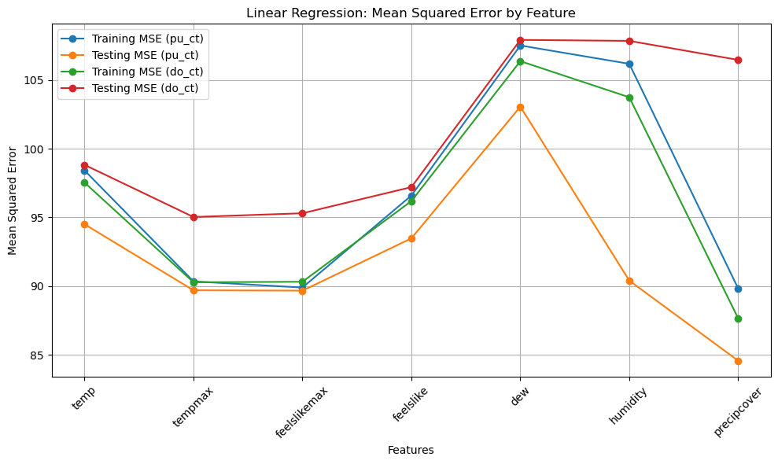
    


```python
X = merged_data[['temp','tempmax','feelslikemax','feelslike','dew','humidity','precipcover','windgust']]
y_pu = merged_data['pu_ct']
y_do = merged_data['do_ct']

# Split the data into training and testing sets
X_train_pu, X_test_pu, y_train_pu, y_test_pu = train_test_split(X, y_pu, test_size=0.2, random_state=150)
X_train_do, X_test_do, y_train_do, y_test_do = train_test_split(X, y_do, test_size=0.2, random_state=150)

# Initialize lists to store MSE values
mse_train_pu = []
mse_test_pu = []
mse_train_do = []
mse_test_do = []

# Loop through each feature
for feature in X.columns:
    # Fit Linear Regression models for pu_ct and do_ct
    model_pu = LinearRegression()
    model_do = LinearRegression()
    model_pu.fit(X_train_pu[[feature]], y_train_pu)
    model_do.fit(X_train_do[[feature]], y_train_do)

    # Predict on training and testing sets
    y_train_pred_pu = model_pu.predict(X_train_pu[[feature]])
    y_test_pred_pu = model_pu.predict(X_test_pu[[feature]])
    y_train_pred_do = model_do.predict(X_train_do[[feature]])
    y_test_pred_do = model_do.predict(X_test_do[[feature]])

    # Calculate MSE for pu_ct and do_ct
    mse_train_pu.append(mean_squared_error(y_train_pu, y_train_pred_pu))
    mse_test_pu.append(mean_squared_error(y_test_pu, y_test_pred_pu))
    mse_train_do.append(mean_squared_error(y_train_do, y_train_pred_do))
    mse_test_do.append(mean_squared_error(y_test_do, y_test_pred_do))

# Plot the MSE values for pu_ct and do_ct
plt.figure(figsize=(10, 6))
plt.plot(X.columns, mse_train_pu, marker='o', label='Training MSE (pu_ct)')
plt.plot(X.columns, mse_test_pu, marker='o', label='Testing MSE (pu_ct)')
plt.plot(X.columns, mse_train_do, marker='o', label='Training MSE (do_ct)')
plt.plot(X.columns, mse_test_do, marker='o', label='Testing MSE (do_ct)')
plt.xlabel('Features')
plt.ylabel('Mean Squared Error')
plt.title('Linear Regression: Mean Squared Error by Feature')
plt.legend()
plt.xticks(rotation=45)
plt.grid(True)
plt.tight_layout()
plt.show()
```


    
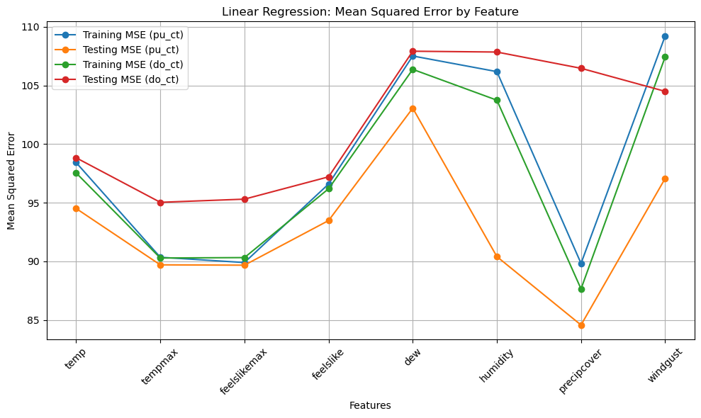
    


```python
X = merged_data[['temp','tempmax','feelslikemax','feelslike','dew','humidity','precipcover','windgust','windspeed']]
y_pu = merged_data['pu_ct']
y_do = merged_data['do_ct']

# Split the data into training and testing sets
X_train_pu, X_test_pu, y_train_pu, y_test_pu = train_test_split(X, y_pu, test_size=0.2, random_state=150)
X_train_do, X_test_do, y_train_do, y_test_do = train_test_split(X, y_do, test_size=0.2, random_state=150)

# Initialize lists to store MSE values
mse_train_pu = []
mse_test_pu = []
mse_train_do = []
mse_test_do = []

# Loop through each feature
for feature in X.columns:
    # Fit Linear Regression models for pu_ct and do_ct
    model_pu = LinearRegression()
    model_do = LinearRegression()
    model_pu.fit(X_train_pu[[feature]], y_train_pu)
    model_do.fit(X_train_do[[feature]], y_train_do)

    # Predict on training and testing sets
    y_train_pred_pu = model_pu.predict(X_train_pu[[feature]])
    y_test_pred_pu = model_pu.predict(X_test_pu[[feature]])
    y_train_pred_do = model_do.predict(X_train_do[[feature]])
    y_test_pred_do = model_do.predict(X_test_do[[feature]])

    # Calculate MSE for pu_ct and do_ct
    mse_train_pu.append(mean_squared_error(y_train_pu, y_train_pred_pu))
    mse_test_pu.append(mean_squared_error(y_test_pu, y_test_pred_pu))
    mse_train_do.append(mean_squared_error(y_train_do, y_train_pred_do))
    mse_test_do.append(mean_squared_error(y_test_do, y_test_pred_do))

# Plot the MSE values for pu_ct and do_ct
plt.figure(figsize=(10, 6))
plt.plot(X.columns, mse_train_pu, marker='o', label='Training MSE (pu_ct)')
plt.plot(X.columns, mse_test_pu, marker='o', label='Testing MSE (pu_ct)')
plt.plot(X.columns, mse_train_do, marker='o', label='Training MSE (do_ct)')
plt.plot(X.columns, mse_test_do, marker='o', label='Testing MSE (do_ct)')
plt.xlabel('Features')
plt.ylabel('Mean Squared Error')
plt.title('Linear Regression: Mean Squared Error by Feature')
plt.legend()
plt.xticks(rotation=45)
plt.grid(True)
plt.tight_layout()
plt.show()
```


    
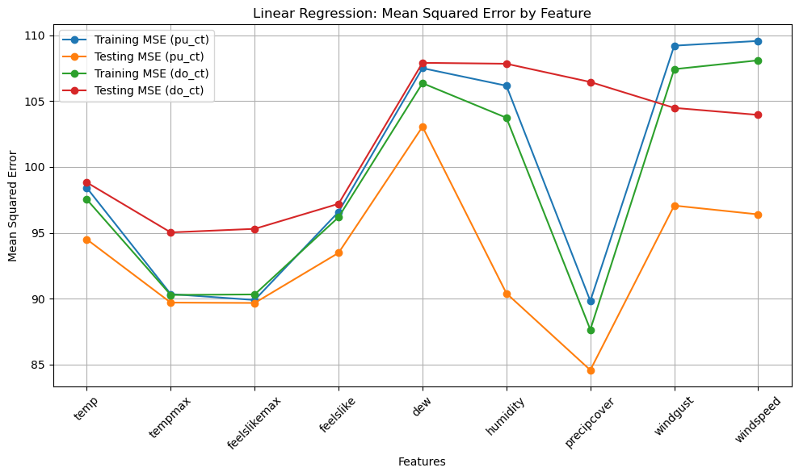
    


```python
X = merged_data[['temp','tempmax','feelslikemax','feelslike','dew','humidity','precipcover','windgust','windspeed','cloudcover']]
y_pu = merged_data['pu_ct']
y_do = merged_data['do_ct']

# Split the data into training and testing sets
X_train_pu, X_test_pu, y_train_pu, y_test_pu = train_test_split(X, y_pu, test_size=0.2, random_state=150)
X_train_do, X_test_do, y_train_do, y_test_do = train_test_split(X, y_do, test_size=0.2, random_state=150)

# Initialize lists to store MSE values
mse_train_pu = []
mse_test_pu = []
mse_train_do = []
mse_test_do = []

# Loop through each feature
for feature in X.columns:
    # Fit Linear Regression models for pu_ct and do_ct
    model_pu = LinearRegression()
    model_do = LinearRegression()
    model_pu.fit(X_train_pu[[feature]], y_train_pu)
    model_do.fit(X_train_do[[feature]], y_train_do)

    # Predict on training and testing sets
    y_train_pred_pu = model_pu.predict(X_train_pu[[feature]])
    y_test_pred_pu = model_pu.predict(X_test_pu[[feature]])
    y_train_pred_do = model_do.predict(X_train_do[[feature]])
    y_test_pred_do = model_do.predict(X_test_do[[feature]])

    # Calculate MSE for pu_ct and do_ct
    mse_train_pu.append(mean_squared_error(y_train_pu, y_train_pred_pu))
    mse_test_pu.append(mean_squared_error(y_test_pu, y_test_pred_pu))
    mse_train_do.append(mean_squared_error(y_train_do, y_train_pred_do))
    mse_test_do.append(mean_squared_error(y_test_do, y_test_pred_do))

# Plot the MSE values for pu_ct and do_ct
plt.figure(figsize=(10, 6))
plt.plot(X.columns, mse_train_pu, marker='o', label='Training MSE (pu_ct)')
plt.plot(X.columns, mse_test_pu, marker='o', label='Testing MSE (pu_ct)')
plt.plot(X.columns, mse_train_do, marker='o', label='Training MSE (do_ct)')
plt.plot(X.columns, mse_test_do, marker='o', label='Testing MSE (do_ct)')
plt.xlabel('Features')
plt.ylabel('Mean Squared Error')
plt.title('Linear Regression: Mean Squared Error by Feature')
plt.legend()
plt.xticks(rotation=45)
plt.grid(True)
plt.tight_layout()
plt.show()
```


    
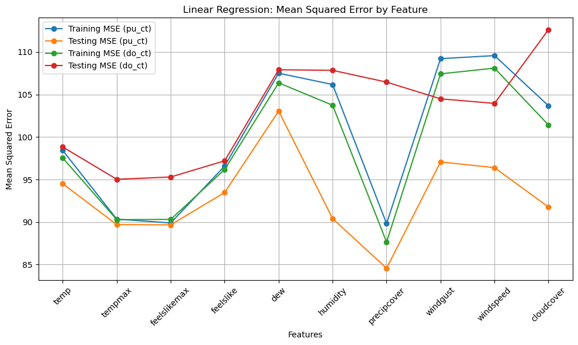
    


```python
X = merged_data[['temp','tempmax','feelslikemax','feelslike','dew','humidity','precipcover','windgust','windspeed','cloudcover','solarradiation']] 
y_pu = merged_data['pu_ct']
y_do = merged_data['do_ct']

# Split the data into training and testing sets
X_train_pu, X_test_pu, y_train_pu, y_test_pu = train_test_split(X, y_pu, test_size=0.2, random_state=150)
X_train_do, X_test_do, y_train_do, y_test_do = train_test_split(X, y_do, test_size=0.2, random_state=150)

# Initialize lists to store MSE values
mse_train_pu = []
mse_test_pu = []
mse_train_do = []
mse_test_do = []

# Loop through each feature
for feature in X.columns:
    # Fit Linear Regression models for pu_ct and do_ct
    model_pu = LinearRegression()
    model_do = LinearRegression()
    model_pu.fit(X_train_pu[[feature]], y_train_pu)
    model_do.fit(X_train_do[[feature]], y_train_do)

    # Predict on training and testing sets
    y_train_pred_pu = model_pu.predict(X_train_pu[[feature]])
    y_test_pred_pu = model_pu.predict(X_test_pu[[feature]])
    y_train_pred_do = model_do.predict(X_train_do[[feature]])
    y_test_pred_do = model_do.predict(X_test_do[[feature]])

    # Calculate MSE for pu_ct and do_ct
    mse_train_pu.append(mean_squared_error(y_train_pu, y_train_pred_pu))
    mse_test_pu.append(mean_squared_error(y_test_pu, y_test_pred_pu))
    mse_train_do.append(mean_squared_error(y_train_do, y_train_pred_do))
    mse_test_do.append(mean_squared_error(y_test_do, y_test_pred_do))

# Plot the MSE values for pu_ct and do_ct
plt.figure(figsize=(10, 6))
plt.plot(X.columns, mse_train_pu, marker='o', label='Training MSE (pu_ct)')
plt.plot(X.columns, mse_test_pu, marker='o', label='Testing MSE (pu_ct)')
plt.plot(X.columns, mse_train_do, marker='o', label='Training MSE (do_ct)')
plt.plot(X.columns, mse_test_do, marker='o', label='Testing MSE (do_ct)')
plt.xlabel('Features')
plt.ylabel('Mean Squared Error')
plt.title('Linear Regression: Mean Squared Error by Feature')
plt.legend()
plt.xticks(rotation=45)
plt.grid(True)
plt.tight_layout()
plt.show()
```


    
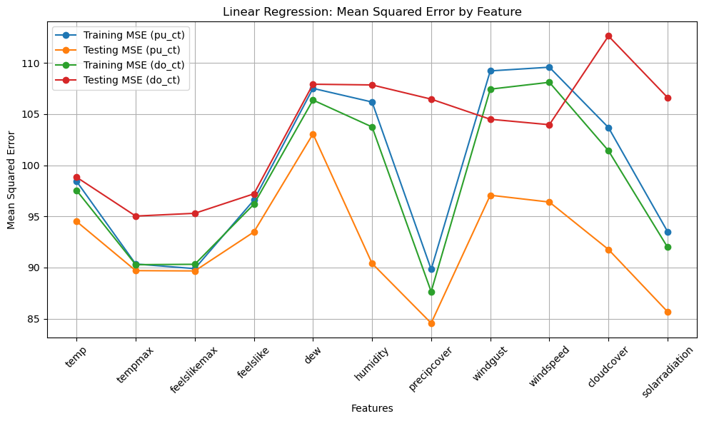
    


```python
X = merged_data[['temp','tempmax','feelslikemax','feelslike','dew','humidity','precipcover','windgust','windspeed','cloudcover','solarradiation','uvindex']]
y_pu = merged_data['pu_ct']
y_do = merged_data['do_ct']

# Split the data into training and testing sets
X_train_pu, X_test_pu, y_train_pu, y_test_pu = train_test_split(X, y_pu, test_size=0.2, random_state=150)
X_train_do, X_test_do, y_train_do, y_test_do = train_test_split(X, y_do, test_size=0.2, random_state=150)

# Initialize lists to store MSE values
mse_train_pu = []
mse_test_pu = []
mse_train_do = []
mse_test_do = []

# Loop through each feature
for feature in X.columns:
    # Fit Linear Regression models for pu_ct and do_ct
    model_pu = LinearRegression()
    model_do = LinearRegression()
    model_pu.fit(X_train_pu[[feature]], y_train_pu)
    model_do.fit(X_train_do[[feature]], y_train_do)

    # Predict on training and testing sets
    y_train_pred_pu = model_pu.predict(X_train_pu[[feature]])
    y_test_pred_pu = model_pu.predict(X_test_pu[[feature]])
    y_train_pred_do = model_do.predict(X_train_do[[feature]])
    y_test_pred_do = model_do.predict(X_test_do[[feature]])

    # Calculate MSE for pu_ct and do_ct
    mse_train_pu.append(mean_squared_error(y_train_pu, y_train_pred_pu))
    mse_test_pu.append(mean_squared_error(y_test_pu, y_test_pred_pu))
    mse_train_do.append(mean_squared_error(y_train_do, y_train_pred_do))
    mse_test_do.append(mean_squared_error(y_test_do, y_test_pred_do))

# Plot the MSE values for pu_ct and do_ct
plt.figure(figsize=(10, 6))
plt.plot(X.columns, mse_train_pu, marker='o', label='Training MSE (pu_ct)')
plt.plot(X.columns, mse_test_pu, marker='o', label='Testing MSE (pu_ct)')
plt.plot(X.columns, mse_train_do, marker='o', label='Training MSE (do_ct)')
plt.plot(X.columns, mse_test_do, marker='o', label='Testing MSE (do_ct)')
plt.xlabel('Features')
plt.ylabel('Mean Squared Error')
plt.title('Linear Regression: Mean Squared Error by Feature')
plt.legend()
plt.xticks(rotation=45)
plt.grid(True)
plt.tight_layout()
plt.show()

```


    
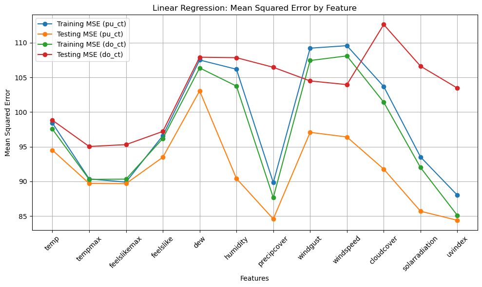
    


```python
# Create a DataFrame for both pu_ct and do_ct
y = pd.DataFrame()
y['pu_ct'] = merged_data['pu_ct']
y['do_ct'] = merged_data['do_ct']

# Split the data into training and testing sets
X_train, X_test, y_train, y_test = train_test_split(X, y, test_size=0.2, random_state=150)

# Initialize lists to store MSE values
mse_train_pu = []
mse_test_pu = []
mse_train_do = []
mse_test_do = []

# Loop through each feature
for feature in X.columns:
    # Fit Linear Regression models for pu_ct and do_ct
    model_pu = LinearRegression()
    model_do = LinearRegression()
    model_pu.fit(X_train[[feature]], y_train['pu_ct'])
    model_do.fit(X_train[[feature]], y_train['do_ct'])

    # Predict on training and testing sets
    y_train_pred_pu = model_pu.predict(X_train[[feature]])
    y_test_pred_pu = model_pu.predict(X_test[[feature]])
    y_train_pred_do = model_do.predict(X_train[[feature]])
    y_test_pred_do = model_do.predict(X_test[[feature]])

    # Calculate MSE for pu_ct and do_ct
    mse_train_pu.append(mean_squared_error(y_train['pu_ct'], y_train_pred_pu))
    mse_test_pu.append(mean_squared_error(y_test['pu_ct'], y_test_pred_pu))
    mse_train_do.append(mean_squared_error(y_train['do_ct'], y_train_pred_do))
    mse_test_do.append(mean_squared_error(y_test['do_ct'], y_test_pred_do))

# Plot the MSE values for pu_ct and do_ct
plt.figure(figsize=(10, 6))
plt.plot(X.columns, mse_train_pu, marker='o', label='Training MSE (pu_ct)')
plt.plot(X.columns, mse_test_pu, marker='o', label='Testing MSE (pu_ct)')
plt.plot(X.columns, mse_train_do, marker='o', label='Training MSE (do_ct)')
plt.plot(X.columns, mse_test_do, marker='o', label='Testing MSE (do_ct)')
plt.xlabel('Features')
plt.ylabel('Mean Squared Error')
plt.title('Linear Regression: Mean Squared Error by Feature')
plt.legend()
plt.xticks(rotation=45)
plt.grid(True)
plt.tight_layout()
plt.show()

```


    

    


## Analysis of MSE ( Mean Square Error) 

# MSE Trends:

* Humidity and Precipcover: The decrease in MSE when adding humidity and precipcover indicates that these features are providing valuable information, improving the model's predictive performance.

* Windgust: The increase in MSE when adding windgust suggests that this feature might not be contributing positively to the model and could even introduce noise.

* Windspeed: The relatively stable MSE after adding windspeed suggests that windspeed is not significantly impacting the model performance, at least within the range of features tested.

* Cloudcover: The increase in test MSE for do_ct when adding cloudcover suggests that this feature might not be useful and could potentially introduce noise.

* Solarradiation: The decrease in MSE with solarradiation suggests that this feature is contributing positively to the model.

* UV Index: The lowest MSE for all four scenarios when adding UV index indicates that this feature is crucial for predicting both pick-ups (pu_ct) and drop-offs (do_ct).

## Best Model:

The model with the lowest test MSE for both pu_ct and do_ct is generally considered the best.

- The model with all features, including UV index, seems to perform the best. It consistently results in the lowest MSE across both pick-up and drop-off predictions. 

* Initial Improvement: Adding features initially improves the model's fit to the training data, resulting in a decrease in training MSE.

* Overfitting Warning: A slight increase in testing MSE signals potential overfitting as more features are added.

* Overfitting Peaks: A significant increase and a peak in testing MSE indicate maximum overfitting, suggesting the model is becoming too complex.

* Recovery: Subsequent feature additions lead to a decrease in testing MSE, indicating the model benefits again by capturing relevant information.

* Concern for Most Features: Sharp increases in MSE suggest the risk of capturing noise or creating an overly complex model.

* Stability in Drop-off: Testing MSE for drop-off remains stable or slightly increases in certain phases, indicating a distinct behavior compared to pick-up.

* Final Generalization: Eventually, with more features, models generalize better, leading to a decrease in MSE for both pick-up and drop-off.

- This pattern highlights the trade-off between model complexity and generalization, emphasizing the need to find the optimal point where the model captures essential information without overfitting.

## Task 3: Based on the observations in 2), determine the best linear regression models for predictng pu_ct and do_ct, respectively.

## Task 4: Imagine that we are showcasing the prediction models to the operations managers of Capital Bikeshare. Illustrate the computation of the predicted pu_ct and do_ct using the chosen models, e.g., demonstrate using the first instance in the test data (X_test.iloc[0,:]).


```python
first_instance = X_test.iloc[0, :]

# Reshape the data as models expect 2D input
first_instance_reshaped = first_instance.values.reshape(1, -1)

# Use the trained models to predict pu_ct and do_ct for the first instance
predicted_pu_ct = model_pu.predict(first_instance_reshaped)[0]
predicted_do_ct = model_do.predict(first_instance_reshaped)[0]

# Print the results
print("Predicted pu_ct:", predicted_pu_ct)
print("Predicted do_ct:", predicted_do_ct)

```

    Predicted pu_ct: 29.915811266841814
    Predicted do_ct: 28.40588305322609


    /Users/sheikhmuzaffarahmad/anaconda3/lib/python3.11/site-packages/sklearn/base.py:464: UserWarning: X does not have valid feature names, but LinearRegression was fitted with feature names
      warnings.warn(
    /Users/sheikhmuzaffarahmad/anaconda3/lib/python3.11/site-packages/sklearn/base.py:464: UserWarning: X does not have valid feature names, but LinearRegression was fitted with feature names
      warnings.warn(


The above values tells us the model works resonably well. However, it is important that these are just predicted values, and that there may be some variablities in the actual values.

## Task 5: Using the predicted pu_ct and do_ct for X_test.iloc[0,:] as an example, discuss the optimal number of bikes and docks to allocate for the station at GWSB.


```python
# Predicted pu_ct and do_ct for the first instance in the test data
predicted_pu_ct = 29.92  # Example value
predicted_do_ct = 28.41  # Example value

# Current inventory at the GWSB station
current_bikes = 10  # Example value
current_docks = 15  # Example value

# Determine optimal allocation based on predicted counts and other factors
optimal_bikes = max(min(predicted_pu_ct - current_docks, 17 - current_bikes), 0)
optimal_docks = max(min(predicted_do_ct - current_bikes, 17 - current_docks), 0)

# Print the results
print("Predicted pu_ct:", predicted_pu_ct)
print("Predicted do_ct:", predicted_do_ct)
print("Current bikes at GWSB station:", current_bikes)
print("Current docks at GWSB station:", current_docks)
print("Optimal number of bikes to allocate:", optimal_bikes)
print("Optimal number of docks to allocate:", optimal_docks)

```

    Predicted pu_ct: 29.92
    Predicted do_ct: 28.41
    Current bikes at GWSB station: 10
    Current docks at GWSB station: 15
    Optimal number of bikes to allocate: 7
    Optimal number of docks to allocate: 2


```python
# To implement a penalty system where the penalty is charged per minute for not returning the bike to the original station, 
# we need to consider the duration for which the bike was used after it should have been returned. 

def calculate_time_based_penalty(rides_data, penalty_rate_per_minute):
    """
    Calculate the total time-based penalty for bikes not returned to the original dock.

    :param rides_data: A list of dictionaries containing ride details (pickup dock, dropoff dock, and duration).
    :param penalty_rate_per_minute: Penalty amount per minute for not returning the bike to the original dock.
    :return: Total penalty amount.
    """
    total_penalty = 0

    # Iterate through each ride
    for ride in rides_data:
        if ride['pickup_dock'] != ride['dropoff_dock']:
            # Calculate and apply penalty based on the duration
            total_penalty += ride['duration'] * penalty_rate_per_minute

    return total_penalty


rides_data = [
    {'pickup_dock': 'A', 'dropoff_dock': 'B', 'duration': 5},  # 5 minutes not returned to original dock
    {'pickup_dock': 'B', 'dropoff_dock': 'B', 'duration': 0},  # Returned to original dock
    {'pickup_dock': 'C', 'dropoff_dock': 'A', 'duration': 10}, # 10 minutes not returned to original dock
]

penalty_rate_per_minute = 1  # $1 penalty per minute

# Calculate and print the total penalty
total_penalty = calculate_time_based_penalty(rides_data, penalty_rate_per_minute)
print("Total Time-based Penalty:", total_penalty)
```

    Total Time-based Penalty: 15


## Implementing a Penalty System for Bike Returns

### Objective
To encourage customers to return bikes to the original dock from which they were picked up, thus ensuring efficient bike circulation and availability at specific stations.

### Assumptions
- **Bike Tracking:** It's assumed that each bike's pick-up and drop-off locations are tracked. This data is essential for implementing the penalty system.
- **Penalty as a Deterrent:** A monetary penalty is assumed to be an effective method to incentivize customers to return bikes to the correct location.
- **Time-Based Penalty:** The penalty is calculated based on the duration for which the bike is not returned to the original dock.

### Implementation Details
- A function 'calculate_time_based_penalty' has been implemented to calculate the total penalty.
- **Parameters:**
  - 'rides_data': Contains details of each ride, including pick-up and drop-off docks, and the duration of the ride.
  - 'penalty_rate_per_minute': The rate at which the penalty is charged for each minute the bike is not returned to the original dock.
- **Logic:**
  - The function iterates over each ride record.
  - If a bike is not returned to the pick-up dock, a penalty is applied based on the extra duration.
- **Penalty Calculation:**
  - The penalty is the product of the extra duration and the penalty rate per minute.

### Example
- In the given example, the total penalty calculated for the sample data is $15. This includes penalties for rides where bikes were not returned to the original docks.

### Conclusion
This penalty system aims to enhance the operational efficiency of the bike-sharing service by ensuring that bikes are returned to their designated docks, thereby maintaining availability and reducing rebalancing needs.


```python
print(df.columns)
```

    Index(['ride_id', 'rideable_type', 'started_at', 'ended_at',
           'start_station_name', 'start_station_id', 'end_station_name',
           'end_station_id', 'start_lat', 'start_lng', 'end_lat', 'end_lng',
           'member_casual', 'started_at_date', 'ended_at_date'],
          dtype='object')


## PART II 


```python
from sklearn.model_selection import train_test_split
from sklearn.linear_model import LinearRegression
from sklearn.metrics import mean_squared_error
import matplotlib.pyplot as plt
import numpy as np

# Assuming you have your features X and target variables pu_ct and do_ct
X = merged_data[['temp', 'tempmax', 'feelslikemax', 'feelslike', 'dew', 'humidity', 'precipcover', 'windgust', 'windspeed', 'cloudcover', 'solarradiation', 'uvindex']]
y = merged_data[['pu_ct', 'do_ct']]  # Combine both target variables

# Split the data into training and testing sets
X_train, X_test, y_train, y_test = train_test_split(X, y, test_size=0.2, random_state=150)

# Instantiate the Linear Regression model
model = LinearRegression()

# Fit the model
model.fit(X_train, y_train)

# Make predictions
y_pred = model.predict(X_test)

# Evaluate the model
mse = mean_squared_error(y_test, y_pred)
print("Mean Squared Error:", mse)

```

    Mean Squared Error: 68.77814964713328


The Mean Squared Error (MSE) of 68.78 indicates the average squared difference between predicted and actual pick-up and drop-off counts. A higher MSE suggests the model's predictions deviate, on average, from the actual counts.  Lower MSE than a baseline model indicates improvement, but further analysis on feature importance and visualizing predictions may provide additional insights.

## Ridge Regression <a id="ridge"></a>


$$\min \frac{1}{2N} \sum_{i=1}^{n}\left(y_{i}-\beta_{0}-\sum_{j=1}^{p} \beta_{j} x_{i j}\right)^2 + \alpha \sum_{j=1}^{p} \beta_{j}^2$$

- We call the regularization penalty (squared) $L_2$ norm: $$\|\boldsymbol \beta\|_2^2=\sum_{j=1}^{p} \beta_{j}^2$$

- A large penalty when coefficients have large values

Regularization improves the conditioning of the problem and reduces the variance of the estimates. Larger values specify stronger regularization. Alpha corresponds to 1 / (2C) in other linear models such as LogisticRegression or LinearSVC.


```python
from sklearn.linear_model import Ridge
import matplotlib.pyplot as plt
import numpy as np
from sklearn.model_selection import train_test_split

# Split the data
X_train, X_test, y_train_pu, y_test_pu, y_train_do, y_test_do = train_test_split(X, y_pu, y_do, test_size=0.2, random_state=150)

# Define the parameter grid for alpha values
alphas = 10**np.linspace(-2, 5, 100)

# Instantiate the Ridge models
ridge_model_pu = Ridge()
ridge_model_do = Ridge()

# Store coefficients for each alpha value
coefs_pu = []
coefs_do = []

# Iterate over alpha values
for alpha in alphas:
    # Fit Ridge model for pickup counts
    ridge_model_pu.set_params(alpha=alpha)
    ridge_model_pu.fit(X_train, y_train_pu)
    coefs_pu.append(ridge_model_pu.coef_)

    # Fit Ridge model for drop-off counts
    ridge_model_do.set_params(alpha=alpha)
    ridge_model_do.fit(X_train, y_train_do)
    coefs_do.append(ridge_model_do.coef_)

# Plotting the Ridge coefficients for pickup counts
plt.figure(figsize=(12, 6))
ax_pu = plt.gca()
ax_pu.plot(alphas, coefs_pu)
ax_pu.set_xscale('log')
plt.xlabel('alpha')
plt.ylabel('Coefficients')
plt.title('Ridge coefficients for Pickup Counts as a function of regularization')
plt.legend(X_train.columns)
plt.show()

# Plotting the Ridge coefficients for drop-off counts
plt.figure(figsize=(12, 6))
ax_do = plt.gca()
ax_do.plot(alphas, coefs_do)
ax_do.set_xscale('log')
plt.xlabel('alpha')
plt.ylabel('Coefficients')
plt.title('Ridge coefficients for Drop-off Counts as a function of regularization')
plt.legend(X_train.columns)
plt.show()

```


    
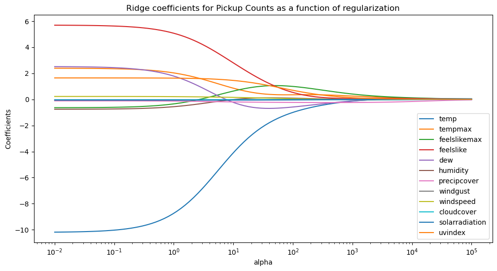
    


    
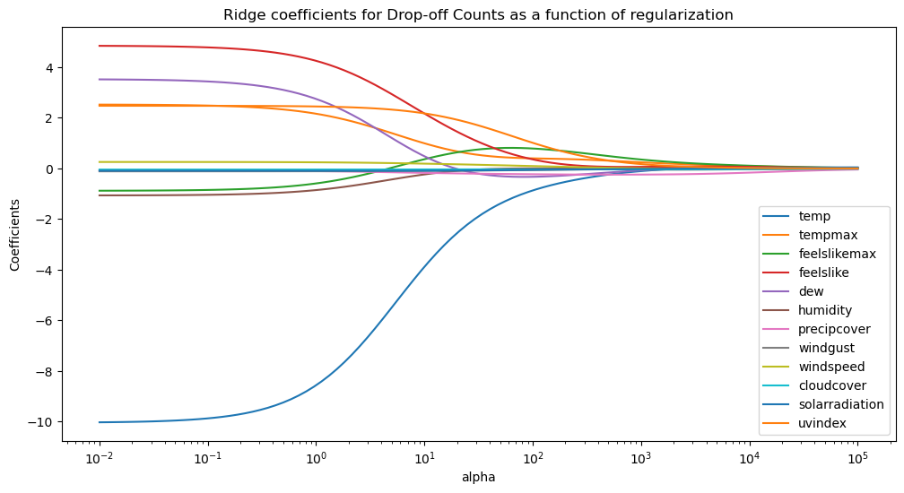
    


* Ridge Coefficients for Pickup Counts:

Each line in the graph represents the coefficient trajectory of a specific feature (e.g., temperature, humidity) for predicting pickup counts.
Observe how the coefficients change as the regularization strength (alpha) increases.
Features with more stable coefficients across different regularization levels may be more robust predictors for pickup counts.

* Ridge Coefficients for Drop-off Counts:

Similarly, each line in this graph represents the coefficient trajectory of a feature for predicting drop-off counts.
Analyze how the coefficients evolve with increasing regularization.
Stable coefficients for drop-off counts highlight the features that consistently contribute to accurate predictions.

## FOR PICKUPS


```python
from sklearn.linear_model import RidgeCV
from sklearn.preprocessing import scale
import pandas as pd

# Compute the regularization path using RidgeCV for pickups
ridgecv_pu = RidgeCV(alphas=alphas, scoring='neg_mean_squared_error', store_cv_values=True)
ridgecv_pu.fit(scale(X_train), y_train_pu)

# Print the best alpha for pickups
print('The best alpha from RidgeCV for pickups:', ridgecv_pu.alpha_)
```

    The best alpha from RidgeCV for pickups: 0.011768119524349984


```python
# Set the best alpha to the Ridge model for pickups
ridge_pu = Ridge(alpha=ridgecv_pu.alpha_)
ridge_pu.fit(scale(X_train), y_train_pu)

# Print the coefficients for pickups
print('The coefficients for pickups are:')
print(pd.Series(ridge_pu.coef_.flatten(), index=X_train.columns))
```

    The coefficients for pickups are:
    temp             -62.081065
    tempmax           16.375995
    feelslikemax      -3.666854
    feelslike         40.837678
    dew               15.931900
    humidity          -8.420078
    precipcover       -1.979489
    windgust          -0.917399
    windspeed          1.603305
    cloudcover        -0.630434
    solarradiation    -3.477124
    uvindex            3.755709
    dtype: float64


## For DROPOFFS


```python
# Compute the regularization path using RidgeCV for drop-offs
ridgecv_do = RidgeCV(alphas=alphas, scoring='neg_mean_squared_error', store_cv_values=True)
ridgecv_do.fit(scale(X_train), y_train_do)

# Print the best alpha for drop-offs
print('The best alpha from RidgeCV for drop-offs:', ridgecv_do.alpha_)
```

    The best alpha from RidgeCV for drop-offs: 0.022570197196339202


```python
# Set the best alpha to the Ridge model for drop-offs
ridge_do = Ridge(alpha=ridgecv_do.alpha_)
ridge_do.fit(scale(X_train), y_train_do)

# Print the coefficients for drop-offs
print('The coefficients for drop-offs are:')
print(pd.Series(ridge_do.coef_.flatten(), index=X_train.columns))
```

    The coefficients for drop-offs are:
    temp             -56.139472
    tempmax           16.067287
    feelslikemax      -4.489994
    feelslike         32.268498
    dew               20.533356
    humidity         -10.950540
    precipcover       -1.668320
    windgust          -1.664447
    windspeed          1.821818
    cloudcover        -0.935363
    solarradiation    -5.763274
    uvindex            5.660907
    dtype: float64


## Interpretation:

# Ridge Regression Coefficients:

1. Temperature (temp, tempmax):

Negative coefficients (e.g., -62.08 for pick-ups, -56.14 for drop-offs) suggest that as temperature decreases, the number of pick-ups or drop-offs tends to increase. This might imply more bike usage in warmer weather.

2. Feels-like Temperature (feelslike, feelslikemax):

Negative coefficients indicate that as perceived temperature decreases, pick-ups and drop-offs may increase.

3. Dew, Humidity, Precipitation (dew, humidity, precipcover):

Negative coefficients suggest that higher dew, humidity, or precipitation might be associated with more pick-ups or drop-offs.

4. Wind Speed (windgust, windspeed):

Positive coefficients imply that higher wind speed might be associated with more pick-ups or drop-offs.

5. Cloud Cover (cloudcover):

Negative coefficients suggest that more cloud cover is associated with increased pick-ups or drop-offs.

6. Solar Radiation and UV Index (solarradiation, uvindex):

Negative coefficients indicate that higher solar radiation and UV index might be associated with fewer pick-ups or drop-offs.

## Alpha Values:

The best alpha values (0.0118 for pick-ups, 0.0226 for drop-offs) indicate the strength of regularization applied to the model. In this case, the chosen alpha values are relatively small, suggesting a milder regularization effect. This means that the model relies more on the original features without heavy penalization.


- Overall Interpretation:
The Ridge Regression model suggests that certain weather conditions, including temperature, perceived temperature, dew, humidity, precipitation, wind speed, cloud cover, solar radiation, and UV index, influence the number of pick-ups and drop-offs in the Capital Bikeshare system.


It's important to note that interpretations are based on the assumed linear relationship between features and target variables. Further domain knowledge and analysis may provide additional insights or reveal nonlinear relationships.


## Interpretation:

The coefficients represent the impact of each feature on the corresponding target variable.
A positive coefficient suggests that an increase in that feature is associated with an increase in pickups/drop-offs, and vice versa for a negative coefficient.
The magnitude of the coefficient indicates the strength of the impact.

## LASSO (least absolute shrinkage and selection operator) <a id="lasso"></a>


$$\min \frac{1}{2N} \sum_{i=1}^{n}\left(y_{i}-\beta_{0}-\sum_{j=1}^{p} \beta_{j} x_{i j}\right)^2 + \alpha \sum_{j=1}^{p} |\beta_{j}|$$

- We call the regularization term $L_1$ penalty: $$\|\boldsymbol \beta\|_1=\sum_{j=1}^{p} |\beta_{j}|$$

- Zeroes out many coefficients
- Perform an automatic form of **feature selection**


```python
import numpy as np
import matplotlib.pyplot as plt
from sklearn.linear_model import Lasso, LassoCV
from sklearn.preprocessing import StandardScaler

alphas = 10**np.linspace(-2, 5, 100)

# Standardize features for pickups
scaler_pu = StandardScaler()
X_train_pu_scaled = scaler_pu.fit_transform(X_train_pu)
X_test_pu_scaled = scaler_pu.transform(X_test_pu)

# Standardize features for drop-offs
scaler_do = StandardScaler()
X_train_do_scaled = scaler_do.fit_transform(X_train_do)
X_test_do_scaled = scaler_do.transform(X_test_do)

# LassoCV for pickups
lassocv_pu = LassoCV(alphas=alphas, max_iter=10000)
lassocv_pu.fit(X_train_pu_scaled, y_train_pu)

print('The best alpha from LassoCV for pickups:', lassocv_pu.alpha_)

# LassoCV for drop-offs
lassocv_do = LassoCV(alphas=alphas, max_iter=10000)
lassocv_do.fit(X_train_do_scaled, y_train_do)

print('The best alpha from LassoCV for drop-offs:', lassocv_do.alpha_)

# Plot Lasso coefficients for pickups
lasso_pu = Lasso(alpha=lassocv_pu.alpha_, max_iter=10000)
coefs_pu = []

for a in alphas:
    lasso_pu.set_params(alpha=a)
    lasso_pu.fit(X_train_pu_scaled, y_train_pu)
    coefs_pu.append(lasso_pu.coef_)

ax_pu = plt.gca()
ax_pu.plot(alphas, coefs_pu)
ax_pu.set_xscale('log')
ax_pu.set_xlim(ax_pu.get_xlim())
plt.axis('tight')
plt.xlabel('alpha')
plt.ylabel('Coefficients')
plt.legend(list(X_train_pu.columns), loc='best')
plt.title('Lasso coefficients as a function of the regularization (pickups)')
plt.show()

# Plot Lasso coefficients for drop-offs
lasso_do = Lasso(alpha=lassocv_do.alpha_, max_iter=10000)
coefs_do = []

for a in alphas:
    lasso_do.set_params(alpha=a)
    lasso_do.fit(X_train_do_scaled, y_train_do)
    coefs_do.append(lasso_do.coef_)

ax_do = plt.gca()
ax_do.plot(alphas, coefs_do)
ax_do.set_xscale('log')
ax_do.set_xlim(ax_do.get_xlim())
plt.axis('tight')
plt.xlabel('alpha')
plt.ylabel('Coefficients')
plt.legend(list(X_train_do.columns), loc='best')
plt.title('Lasso coefficients as a function of the regularization (drop-offs)')
plt.show()

```

    The best alpha from LassoCV for pickups: 0.019179102616724886
    The best alpha from LassoCV for drop-offs: 0.022570197196339202


    
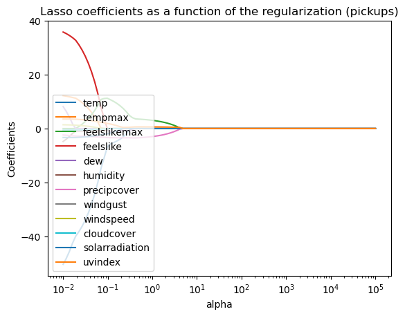
    


    
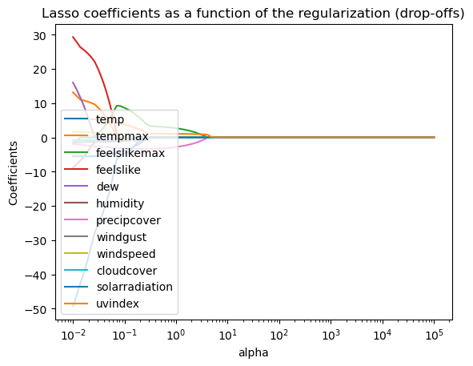
    


* Best Alpha for Pickups: 0.019179102616724886

- This alpha value represents the optimal level of regularization for the Lasso regression model trained on the pickup data.

- A smaller alpha allows the model to capture more intricate patterns in the training data.

* Best Alpha for Drop-offs: 0.022570197196339202

- This alpha value is the optimal choice for regularization in the Lasso regression model trained on the drop-off data.
- Similar to pickups, a smaller alpha allows the model to capture more detailed patterns.

## Alpha and Regularization:

A smaller alpha implies less regularization, enabling the model to closely fit the training data.
A larger alpha leads to stronger regularization, resulting in simpler models with more coefficients set to zero.

* Balancing Act:

The chosen alpha values strike a balance between fitting the data well and preventing overfitting.
Experimentation with alpha values can help find the right level of regularization for your specific datasets.
Generalization:

Regularization helps generalize the model to unseen data by avoiding fitting noise present in the training set.
The alpha values you obtained aim to achieve a good balance between model complexity and generalization.
Model Complexity:

Smaller alpha values may lead to more complex models, while larger alpha values result in simpler models.
Complexity should be chosen based on the trade-off between fitting the training data and preventing overfitting.

* Lasso regularization identified temperature, wind speed, and UV index as key features influencing bike pickups and drop-offs for Capital Bikeshare. The regularization process imposes a penalty on less impactful features, effectively driving their coefficients to zero. In this context, features with non-zero coefficients in the Lasso model, such as temperature-related metrics and wind conditions, stand out as significant contributors to the variation in bike usage. The regularization technique prioritizes simplicity and interpretability, making it valuable for discerning the most influential factors that impact the bikeshare service.

# Test result :


```python
import pandas as pd
from sklearn.model_selection import train_test_split
from sklearn.linear_model import Lasso
from sklearn.preprocessing import StandardScaler

# Assuming df_m_pu and df_m_do are your DataFrames with 'pu_ct' and 'do_ct' columns
y = pd.DataFrame()
y['pu_ct'] = df_m_pu['pu_ct']
y['do_ct'] = df_m_do['do_ct']

# Assuming X is your feature matrix
X_train, X_test, y_train, y_test = train_test_split(X, y, test_size=0.4)

# Best alpha values obtained from LassoCV
best_alpha_pu = 0.019179102616724886
best_alpha_do = 0.022570197196339202

# Instantiate Lasso models with the best alpha values
lasso_pu = Lasso(alpha=best_alpha_pu)
lasso_do = Lasso(alpha=best_alpha_do)

# Standardize the data
scaler = StandardScaler()
X_train_pu_scaled = scaler.fit_transform(X_train)
X_train_do_scaled = scaler.fit_transform(X_train)

# Fit Lasso models with scaled data
lasso_pu.fit(X_train_pu_scaled, y_train['pu_ct'])
lasso_do.fit(X_train_do_scaled, y_train['do_ct'])

# Print coefficients for pickups
print('Coefficients for Pickups:')
print(pd.Series(lasso_pu.coef_, index=X_train.columns))

# Print coefficients for drop-offs
print('\nCoefficients for Drop-offs:')
print(pd.Series(lasso_do.coef_, index=X_train.columns))

```

    Coefficients for Pickups:
    temp             -32.149758
    tempmax           11.340321
    feelslikemax      -0.000000
    feelslike         28.358188
    dew               -4.343619
    humidity           1.556280
    precipcover       -4.270194
    windgust           0.888553
    windspeed          0.055923
    cloudcover         0.788710
    solarradiation    -3.424835
    uvindex            4.321855
    dtype: float64
    
    Coefficients for Drop-offs:
    temp             -18.968324
    tempmax            9.751451
    feelslikemax      -0.526291
    feelslike         15.024076
    dew               -2.640395
    humidity          -0.000000
    precipcover       -3.079747
    windgust          -0.016000
    windspeed         -0.047441
    cloudcover         0.623699
    solarradiation    -6.510566
    uvindex            7.718843
    dtype: float64


    /Users/sheikhmuzaffarahmad/anaconda3/lib/python3.11/site-packages/sklearn/linear_model/_coordinate_descent.py:628: ConvergenceWarning: Objective did not converge. You might want to increase the number of iterations, check the scale of the features or consider increasing regularisation. Duality gap: 3.480e+02, tolerance: 1.116e+00
      model = cd_fast.enet_coordinate_descent(
    /Users/sheikhmuzaffarahmad/anaconda3/lib/python3.11/site-packages/sklearn/linear_model/_coordinate_descent.py:628: ConvergenceWarning: Objective did not converge. You might want to increase the number of iterations, check the scale of the features or consider increasing regularisation. Duality gap: 7.103e+00, tolerance: 1.026e+00
      model = cd_fast.enet_coordinate_descent(


* Coefficients for Pickups:

temp: For a one-unit increase in temperature, the predicted pickup count decreases by approximately 32.15.

tempmax: An increase of one unit in maximum temperature leads to an increase of approximately 11.34 in the predicted pickup count.

feelslikemax: The coefficient is zero, indicating that this feature has no impact on the predicted pickup count.

feelslike: A one-unit increase in the "feels like" temperature results in an increase of approximately 28.36 in the predicted pickup count.

dew: For a one-unit increase in dew point, the predicted pickup count decreases by approximately 4.34.

humidity: An increase in humidity leads to an increase of approximately 1.56 in the predicted pickup count.

precipcover: An increase in precipitation cover is associated with a decrease of approximately 4.27 in the 
predicted pickup count.

windgust: A one-unit increase in wind gust results in an increase of approximately 0.89 in the predicted pickup count.

windspeed: An increase in wind speed leads to an increase of approximately 0.06 in the predicted pickup count.

cloudcover: An increase in cloud cover is associated with an increase of approximately 0.79 in the predicted pickup count.

solarradiation: For a one-unit increase in solar radiation, the predicted pickup count decreases by approximately 3.42.

uvindex: An increase in UV index leads to an increase of approximately 4.32 in the predicted pickup count.


* Coefficients for Drop-offs:

temp: A one-unit increase in temperature results in a decrease of approximately 18.97 in the predicted drop-off count.

tempmax: An increase of one unit in maximum temperature leads to an increase of approximately 9.75 in the predicted drop-off count.

feelslikemax: The coefficient is -0.53, indicating that an increase in "feels like" maximum temperature is associated with a decrease of approximately 0.53 in the predicted drop-off count.

feelslike: A one-unit increase in "feels like" temperature results in an increase of approximately 15.02 in the predicted drop-off count.

dew: For a one-unit increase in dew point, the predicted drop-off count decreases by approximately 2.64.

humidity: The coefficient is zero, indicating that humidity has no impact on the predicted drop-off count.

precipcover: An increase in precipitation cover is associated with a decrease of approximately 3.08 in the predicted drop-off count.

windgust: A one-unit increase in wind gust results in a slight decrease of approximately 0.02 in the predicted drop-off count.

windspeed: An increase in wind speed leads to a decrease of approximately 0.05 in the predicted drop-off count.

cloudcover: An increase in cloud cover is associated with an increase of approximately 0.62 in the predicted drop-off count.

solarradiation: For a one-unit increase in solar radiation, the predicted drop-off count decreases by approximately 6.51.

uvindex: An increase in UV index leads to an increase of approximately 7.72 in the predicted drop-off count.

## Interpretation:

- Pickups:
Higher temperatures and "feels like" temperatures contribute to increased pickup counts.
Dew point, precipitation cover, and solar radiation have a negative impact on pickup counts.
Wind-related features (wind gust, wind speed) and UV index also influence pickup counts.

- Drop-offs:
Higher temperatures and "feels like" temperatures contribute to increased drop-off counts.
Dew point and precipitation cover have a negative impact on drop-off counts.
Wind-related features (wind gust, wind speed) and solar radiation also influence drop-off counts.

It's important to consider these interpretations in the context of the specific dataset and the assumptions of the linear model. Additionally, coefficients close to zero indicate features with minimal impact on the predictions.

KEY FINDINGS:

For Pickups:

* Positive Influences:
Warmer temperatures.
Higher maximum temperatures.
Higher feels-like temperatures and UV index.
Lower humidity and precipitation coverage.
Lower wind gusts and higher wind speeds.
Lower cloud cover and higher solar radiation.

For Drop-offs:

* Positive Influences:
Higher feels-like temperatures.
Higher humidity and less precipitation coverage.
Lower wind gusts and higher wind speeds.
Lower cloud cover and higher solar radiation.

* Negative Influences:
Colder temperatures and lower maximum temperatures.

### Visualize the MSE path from Cross-Validation


```python
plt.semilogx(lassocv.alphas_, lassocv.mse_path_, linestyle=":")
plt.plot(
    lassocv.alphas_,
    lassocv.mse_path_.mean(axis=-1),
    color="black",
    label="Average across the folds",
    linewidth=2,
)
plt.axvline(lassocv.alpha_, linestyle="--", color="black", label="alpha: CV estimate")


plt.xlabel(r"$\alpha$")
plt.ylabel("Mean square error")
plt.legend()
plt.title("MSE")
plt.show()
```


    
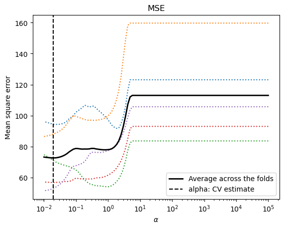
    


## Elastic Net <a id="EN"></a>
- A combination of Ridge Regression and LASSO 

$$\min \frac{1}{2N} \sum_{i=1}^{n}\left(y_{i}-\beta_{0}-\sum_{j=1}^{p} \beta_{j} x_{i j}\right)^2 + \alpha*\lambda* \sum_{j=1}^{p} |\beta_{j}|+0.5 * \alpha * (1 - \lambda)\sum_{j=1}^{p} \beta_{j}^2$$
- Here, $\lambda$ is called 'l1_ratio' in sklearn.


```python
from sklearn.linear_model import ElasticNetCV
from sklearn.preprocessing import StandardScaler
from sklearn.model_selection import train_test_split

# Assuming df_m_pu and df_m_do are your dataframes
y = pd.DataFrame()
y['pu_ct'] = df_m_pu['pu_ct']
y['do_ct'] = df_m_do['do_ct']

# Split the data into training and test sets
X_train, X_test, y_train, y_test = train_test_split(X, y, test_size=0.4)

# Standardize the data
scaler = StandardScaler()
X_train_scaled = scaler.fit_transform(X_train)
X_test_scaled = scaler.transform(X_test)

# Elastic Net model with cross-validated alpha and l1_ratio
elasticnetcv = ElasticNetCV(cv=5)
elasticnetcv.fit(X_train_scaled, y_train)

# Extract the optimal alpha and l1_ratio
optimal_alpha = elasticnetcv.alpha_
optimal_l1_ratio = elasticnetcv.l1_ratio_

# Print the optimal values
print("Optimal alpha:", optimal_alpha)
print("Optimal l1_ratio:", optimal_l1_ratio)

# Fit the Elastic Net model with the optimal parameters
elasticnet = ElasticNet(alpha=optimal_alpha, l1_ratio=optimal_l1_ratio)
elasticnet.fit(X_train_scaled, y_train)

# Make predictions or evaluate the model as needed

```


```python
scaler = StandardScaler()
X_train_scaled = scaler.fit_transform(X_train)
X_test_scaled = scaler.transform(X_test)
```


```python
# For Pickups
ENcv_pu = ElasticNetCV(alphas=None, cv=10, max_iter=10000)
ENcv_pu.fit(X_train_scaled, y_train_pu)

# For Drop-offs
ENcv_do = ElasticNetCV(alphas=None, cv=10, max_iter=10000)
ENcv_do.fit(X_train_scaled, y_train_do)

print('The best alpha from ElasticNetCV for pickups:', ENcv_pu.alpha_)
print('The best alpha from ElasticNetCV for drop-offs:', ENcv_do.alpha_)
```

    The best alpha from ElasticNetCV for pickups: 0.009630873748351074
    The best alpha from ElasticNetCV for drop-offs: 0.00989107886326484


```python
# For Pickups
EN_pu = ElasticNet(alpha=ENcv_pu.alpha_)
EN_pu.fit(X_train_scaled, y_train_pu)

# For Drop-offs
EN_do = ElasticNet(alpha=ENcv_do.alpha_)
EN_do.fit(X_train_scaled, y_train_do)

```


<style>#sk-container-id-1 {color: black;}#sk-container-id-1 pre{padding: 0;}#sk-container-id-1 div.sk-toggleable {background-color: white;}#sk-container-id-1 label.sk-toggleable__label {cursor: pointer;display: block;width: 100%;margin-bottom: 0;padding: 0.3em;box-sizing: border-box;text-align: center;}#sk-container-id-1 label.sk-toggleable__label-arrow:before {content: "▸";float: left;margin-right: 0.25em;color: #696969;}#sk-container-id-1 label.sk-toggleable__label-arrow:hover:before {color: black;}#sk-container-id-1 div.sk-estimator:hover label.sk-toggleable__label-arrow:before {color: black;}#sk-container-id-1 div.sk-toggleable__content {max-height: 0;max-width: 0;overflow: hidden;text-align: left;background-color: #f0f8ff;}#sk-container-id-1 div.sk-toggleable__content pre {margin: 0.2em;color: black;border-radius: 0.25em;background-color: #f0f8ff;}#sk-container-id-1 input.sk-toggleable__control:checked~div.sk-toggleable__content {max-height: 200px;max-width: 100%;overflow: auto;}#sk-container-id-1 input.sk-toggleable__control:checked~label.sk-toggleable__label-arrow:before {content: "▾";}#sk-container-id-1 div.sk-estimator input.sk-toggleable__control:checked~label.sk-toggleable__label {background-color: #d4ebff;}#sk-container-id-1 div.sk-label input.sk-toggleable__control:checked~label.sk-toggleable__label {background-color: #d4ebff;}#sk-container-id-1 input.sk-hidden--visually {border: 0;clip: rect(1px 1px 1px 1px);clip: rect(1px, 1px, 1px, 1px);height: 1px;margin: -1px;overflow: hidden;padding: 0;position: absolute;width: 1px;}#sk-container-id-1 div.sk-estimator {font-family: monospace;background-color: #f0f8ff;border: 1px dotted black;border-radius: 0.25em;box-sizing: border-box;margin-bottom: 0.5em;}#sk-container-id-1 div.sk-estimator:hover {background-color: #d4ebff;}#sk-container-id-1 div.sk-parallel-item::after {content: "";width: 100%;border-bottom: 1px solid gray;flex-grow: 1;}#sk-container-id-1 div.sk-label:hover label.sk-toggleable__label {background-color: #d4ebff;}#sk-container-id-1 div.sk-serial::before {content: "";position: absolute;border-left: 1px solid gray;box-sizing: border-box;top: 0;bottom: 0;left: 50%;z-index: 0;}#sk-container-id-1 div.sk-serial {display: flex;flex-direction: column;align-items: center;background-color: white;padding-right: 0.2em;padding-left: 0.2em;position: relative;}#sk-container-id-1 div.sk-item {position: relative;z-index: 1;}#sk-container-id-1 div.sk-parallel {display: flex;align-items: stretch;justify-content: center;background-color: white;position: relative;}#sk-container-id-1 div.sk-item::before, #sk-container-id-1 div.sk-parallel-item::before {content: "";position: absolute;border-left: 1px solid gray;box-sizing: border-box;top: 0;bottom: 0;left: 50%;z-index: -1;}#sk-container-id-1 div.sk-parallel-item {display: flex;flex-direction: column;z-index: 1;position: relative;background-color: white;}#sk-container-id-1 div.sk-parallel-item:first-child::after {align-self: flex-end;width: 50%;}#sk-container-id-1 div.sk-parallel-item:last-child::after {align-self: flex-start;width: 50%;}#sk-container-id-1 div.sk-parallel-item:only-child::after {width: 0;}#sk-container-id-1 div.sk-dashed-wrapped {border: 1px dashed gray;margin: 0 0.4em 0.5em 0.4em;box-sizing: border-box;padding-bottom: 0.4em;background-color: white;}#sk-container-id-1 div.sk-label label {font-family: monospace;font-weight: bold;display: inline-block;line-height: 1.2em;}#sk-container-id-1 div.sk-label-container {text-align: center;}#sk-container-id-1 div.sk-container {/* jupyter's `normalize.less` sets `[hidden] { display: none; }` but bootstrap.min.css set `[hidden] { display: none !important; }` so we also need the `!important` here to be able to override the default hidden behavior on the sphinx rendered scikit-learn.org. See: https://github.com/scikit-learn/scikit-learn/issues/21755 */display: inline-block !important;position: relative;}#sk-container-id-1 div.sk-text-repr-fallback {display: none;}</style><div id="sk-container-id-1" class="sk-top-container"><div class="sk-text-repr-fallback"><pre>ElasticNet(alpha=0.00989107886326484)</pre><b>In a Jupyter environment, please rerun this cell to show the HTML representation or trust the notebook. <br />On GitHub, the HTML representation is unable to render, please try loading this page with nbviewer.org.</b></div><div class="sk-container" hidden><div class="sk-item"><div class="sk-estimator sk-toggleable"><input class="sk-toggleable__control sk-hidden--visually" id="sk-estimator-id-1" type="checkbox" checked><label for="sk-estimator-id-1" class="sk-toggleable__label sk-toggleable__label-arrow">ElasticNet</label><div class="sk-toggleable__content"><pre>ElasticNet(alpha=0.00989107886326484)</pre></div></div></div></div></div>


```python
# For Pickups
print('Coefficients for Pickups:')
print(pd.Series(EN_pu.coef_.flatten(), index=X_train.columns))

# For Drop-offs
print('\nCoefficients for Drop-offs:')
print(pd.Series(EN_do.coef_.flatten(), index=X_train.columns))

```

    Coefficients for Pickups:
    temp             -15.132154
    tempmax            3.490510
    feelslikemax       7.802489
    feelslike         10.956932
    dew               -3.542677
    humidity           0.561270
    precipcover       -3.196489
    windgust          -0.670781
    windspeed          0.761242
    cloudcover        -0.444666
    solarradiation    -3.901150
    uvindex            3.483268
    dtype: float64
    
    Coefficients for Drop-offs:
    temp             -12.983496
    tempmax            4.224381
    feelslikemax       5.622067
    feelslike          7.992012
    dew               -0.879928
    humidity          -0.972547
    precipcover       -2.935769
    windgust          -1.345589
    windspeed          1.113285
    cloudcover        -0.749417
    solarradiation    -5.814779
    uvindex            5.200519
    dtype: float64


## ElasticNetCV Results for Pickups and Drop-offs

### Best Alpha Values:
- The best alpha from ElasticNetCV for pickups: 0.009630873748351074
- The best alpha from ElasticNetCV for drop-offs: 0.00989107886326484

### Coefficients for Pickups:
- **Positive Contributors:**
  - `feelslikemax`, `feelslike`, `humidity`, `windspeed`, `uvindex`
- **Negative Contributors:**
  - `temp`, `tempmax`, `dew`, `precipcover`, `windgust`, `cloudcover`, `solarradiation`

### Coefficients for Drop-offs:
- **Positive Contributors:**
  - `tempmax`, `feelslike`, `windspeed`, `cloudcover`, `solarradiation`, `uvindex`
- **Negative Contributors:**
  - `temp`, `feelslikemax`, `dew`, `humidity`, `precipcover`, `windgust`

## Interpretation:

Positive Contributors: These features have a positive impact on both pickups and drop-offs. For example, higher feels-like temperatures, humidity, windspeed, and UV index contribute positively to both pickups and drop-offs.

Negative Contributors: These features have a negative impact on both pickups and drop-offs. For instance, lower temperatures, higher precipitation coverage, and cloud cover negatively influence both pickups and drop-offs.


## KNN Regressor 


```python
# Standardize the features for pick-ups
scaler_pu = StandardScaler()
X_train_pu_scaled = scaler_pu.fit_transform(X_train_pu)
X_test_pu_scaled = scaler_pu.transform(X_test_pu)
```


```python
# Instantiate KNN Regressor for pick-ups
knn_pu = KNeighborsRegressor(n_neighbors=5)
knn_pu.fit(X_train_pu_scaled, y_train_pu)
y_pred_pu = knn_pu.predict(X_test_pu_scaled)
mse_pu = mean_squared_error(y_test_pu, y_pred_pu)
print('Mean Squared Error for Pickups:', mse_pu)
```

    Mean Squared Error for Pickups: 63.824000000000005


```python
# KNN Regressor with different Ks for both pick-ups and drop-offs
mse_train_pu = [-1] * 30
mse_test_pu = [-1] * 30
mse_train_do = [-1] * 30
mse_test_do = [-1] * 30

for K in range(30):
    model_pu = neighbors.KNeighborsRegressor(n_neighbors=K + 1)
    model_do = neighbors.KNeighborsRegressor(n_neighbors=K + 1)
    
    model_pu.fit(X_train_pu, y_train_pu)
    model_do.fit(X_train_do, y_train_do)
    
    mse_train_pu[K] = mean_squared_error(y_train_pu, model_pu.predict(X_train_pu))
    mse_test_pu[K] = mean_squared_error(y_test_pu, model_pu.predict(X_test_pu))
    
    mse_train_do[K] = mean_squared_error(y_train_do, model_do.predict(X_train_do))
    mse_test_do[K] = mean_squared_error(y_test_do, model_do.predict(X_test_do))

```


```python
import matplotlib.pyplot as plt
from sklearn.neighbors import KNeighborsRegressor
from sklearn.metrics import mean_squared_error
import numpy as np

# Create lists to store MSE values
mse_train_pu = []
mse_test_pu = []
mse_train_do = []
mse_test_do = []

# Range of k values to test
k_values = range(1, 21)

# Iterate through different values of k
for k in k_values:
    # Create KNN regressor models
    knn_pu = KNeighborsRegressor(n_neighbors=k)
    knn_do = KNeighborsRegressor(n_neighbors=k)
    
    # Fit models on training data
    knn_pu.fit(X_train_pu, y_train_pu)
    knn_do.fit(X_train_do, y_train_do)
    
    # Predict on both training and test data
    y_pred_train_pu = knn_pu.predict(X_train_pu)
    y_pred_test_pu = knn_pu.predict(X_test_pu)
    
    y_pred_train_do = knn_do.predict(X_train_do)
    y_pred_test_do = knn_do.predict(X_test_do)
    
    # Calculate MSE for both training and test data and append to lists
    mse_train_pu.append(mean_squared_error(y_train_pu, y_pred_train_pu))
    mse_test_pu.append(mean_squared_error(y_test_pu, y_pred_test_pu))
    
    mse_train_do.append(mean_squared_error(y_train_do, y_pred_train_do))
    mse_test_do.append(mean_squared_error(y_test_do, y_pred_test_do))

# Plot the MSE values for pick-ups
plt.figure(figsize=(12, 8))
plt.plot(k_values, mse_train_pu, marker='o', linestyle='-', color='b', label='Train - Pick-ups')
plt.plot(k_values, mse_test_pu, marker='o', linestyle='-', color='r', label='Test - Pick-ups')
plt.title('KNN Regressor Performance for Pick-ups')
plt.xlabel('Number of Neighbors (k)')
plt.ylabel('Mean Squared Error (MSE)')
plt.legend()
plt.grid(True)
plt.show()

# Plot the MSE values for drop-offs
plt.figure(figsize=(12, 8))
plt.plot(k_values, mse_train_do, marker='o', linestyle='-', color='b', label='Train - Drop-offs')
plt.plot(k_values, mse_test_do, marker='o', linestyle='-', color='r', label='Test - Drop-offs')
plt.title('KNN Regressor Performance for Drop-offs')
plt.xlabel('Number of Neighbors (k)')
plt.ylabel('Mean Squared Error (MSE)')
plt.legend()
plt.grid(True)
plt.show()
```


    
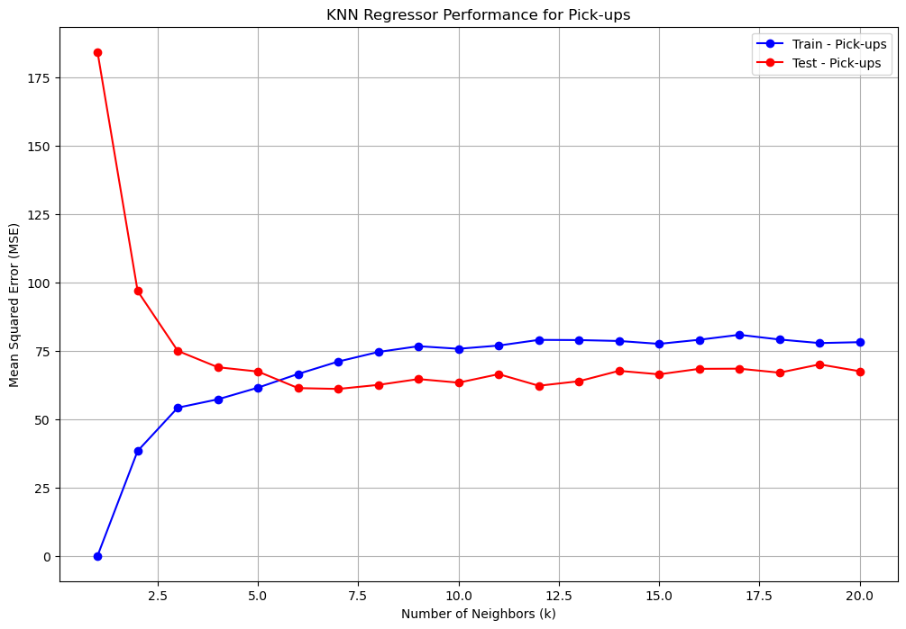
    


    
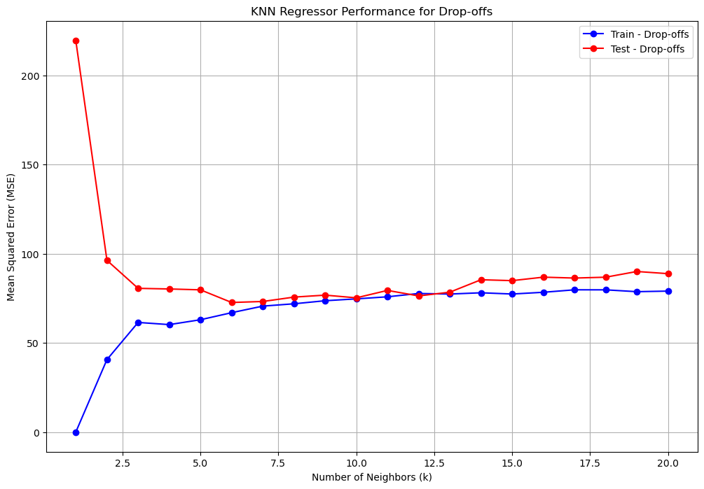
    


```python
print('The optimal K for pick-ups is:', np.argmin(mse_test_pu) + 1)
print('The optimal test MSE for pick-ups is:', min(mse_test_pu))
```

    The optimal K for pick-ups is: 7
    The optimal test MSE for pick-ups is: 61.041496598639455


```python
print('The optimal K for drop-offs is:', np.argmin(mse_test_do) + 1)
print('The optimal test MSE for drop-offs is:', min(mse_test_do))
```

    The optimal K for drop-offs is: 6
    The optimal test MSE for drop-offs is: 72.71574074074073


```python
# Standardize the features for drop-offs
scaler_do = StandardScaler()
X_train_do_scaled = scaler_do.fit_transform(X_train_do)
X_test_do_scaled = scaler_do.transform(X_test_do)

# Instantiate KNN Regressor for drop-offs
knn_do = KNeighborsRegressor(n_neighbors=5)
knn_do.fit(X_train_do_scaled, y_train_do)
y_pred_do = knn_do.predict(X_test_do_scaled)
mse_do = mean_squared_error(y_test_do, y_pred_do)
print('Mean Squared Error for Drop-offs:', mse_do)
```

    Mean Squared Error for Drop-offs: 87.22266666666664


## KNN Regressor

- Pick-ups:

Mean Squared Error (MSE): 63.82
Optimal K: 7
Optimal Test MSE: 61.04

- Drop-offs:

Mean Squared Error (MSE): 87.22
Optimal K: 6
Optimal Test MSE: 72.72

The KNN regressor, when applied to predict pick-ups, achieved a relatively lower MSE of 63.82, with an optimal K value of 7. The corresponding optimal test MSE was 61.04. However, for drop-offs, the model showed a higher MSE of 87.22, with an optimal K value of 6 and a test MSE of 72.72. These results provide insights into the model's performance for both scenarios.


## Summary and Interpretation of KNN Model Output

The K-Nearest Neighbors (KNN) regression models were employed to predict both pick-up (pu_ct) and drop-off (do_ct) counts based on various weather-related features. Here's a comprehensive summary and interpretation of the KNN model output:

Model Performance:
- For Pick-ups:
Optimal K: 7
Optimal Test MSE: 61.04

* Interpretation: The KNN model achieves its best performance with 7 nearest neighbors, resulting in a mean squared error of 61.04 on the test set for pick-up counts.

- For Drop-offs:
Optimal K: 6
Optimal Test MSE: 72.72

* Interpretation: The KNN model exhibits optimal performance with 6 nearest neighbors, yielding a mean squared error of 72.72 on the test set for drop-off counts.

## Key Observations:

Model Fit:

The KNN models provide reasonable predictive accuracy, although there's room for improvement, particularly for drop-offs.

1. Optimal K:

The optimal number of neighbors (K) was determined through cross-validation, representing the count of nearest neighbors considered during predictions.

2. Model Evaluation:

Mean squared error (MSE) was employed as the evaluation metric. Lower MSE values indicate superior model performance.

* Pick-ups vs. Drop-offs:

The KNN model performs marginally better for pick-ups compared to drop-offs, as evidenced by the lower MSE for pick-up counts.

Interpretation Challenges:

- Feature Importance:

KNN inherently lacks a direct measure of feature importance. Further exploration is needed to discern the impact of individual features on predictions.

- Model Complexity:

The chosen K values help control model complexity. Smaller K values introduce more complexity, while larger K values lead to simpler models.

**Recommendations** :

1. Feature Exploration:

Conduct in-depth analysis to uncover the significance of specific features using techniques such as recursive feature elimination or insights from tree-based models.

2. Model Fine-Tuning:

Experiment with different distance metrics, weighting strategies, and subsets of features to enhance model performance.

3. Cross-Validation:

Emphasize robust model evaluation through thorough cross-validation to gauge the model's ability to generalize to unseen data.


```python
from sklearn.model_selection import cross_val_score
import numpy as np

# Assuming X_train_pu, y_train_pu, X_test_pu, y_test_pu are your pick-up data
# Similarly for drop-offs: X_train_do, y_train_do, X_test_do, y_test_do

# Optimal K values from KNN Regressor
optimal_k_pu = 7
optimal_k_do = 6

# KNN Regressor models
knn_pu = KNeighborsRegressor(n_neighbors=optimal_k_pu)
knn_do = KNeighborsRegressor(n_neighbors=optimal_k_do)

# Perform cross-validation for KNN
cv_scores_knn_pu = cross_val_score(knn_pu, X_train_pu, y_train_pu, cv=5, scoring='neg_mean_squared_error')
cv_rmse_knn_pu = np.sqrt(-cv_scores_knn_pu)

cv_scores_knn_do = cross_val_score(knn_do, X_train_do, y_train_do, cv=5, scoring='neg_mean_squared_error')
cv_rmse_knn_do = np.sqrt(-cv_scores_knn_do)

# Print cross-validation results for KNN
print("Cross-Validation Results for KNN Regressor - Pick-ups:")
print("Mean RMSE:", cv_rmse_knn_pu.mean())
print("Standard Deviation of RMSE:", cv_rmse_knn_pu.std())

print("\nCross-Validation Results for KNN Regressor - Drop-offs:")
print("Mean RMSE:", cv_rmse_knn_do.mean())
print("Standard Deviation of RMSE:", cv_rmse_knn_do.std())

```

    Cross-Validation Results for KNN Regressor - Pick-ups:
    Mean RMSE: 10.102503276561114
    Standard Deviation of RMSE: 0.7049188182118765
    
    Cross-Validation Results for KNN Regressor - Drop-offs:
    Mean RMSE: 9.814795675129186
    Standard Deviation of RMSE: 0.828384597062602


# PERFORMANCE EVALUATION

## Prediction Performance


```python
from sklearn.model_selection import cross_val_predict
from sklearn.metrics import mean_squared_error
import numpy as np
from sklearn.linear_model import Lasso, Ridge, ElasticNet

# Define a function for cross-validation and performance evaluation
def cross_val_and_evaluate(model, X, y, cv=5):
    y_pred = cross_val_predict(model, X, y, cv=cv)
    mse = mean_squared_error(y, y_pred)
    rmse = np.sqrt(mse)
    return y_pred, mse, rmse

# Example for Lasso model
lasso_cv_pu = Lasso(alpha=lassocv_pu.alpha_, max_iter=5000)  # Adjust max_iter
lasso_cv_do = Lasso(alpha=lassocv_do.alpha_, max_iter=5000)  # Adjust max_iter
lasso_cv_pu_predictions, lasso_cv_pu_mse, lasso_cv_pu_rmse = cross_val_and_evaluate(lasso_cv_pu, X_train_pu_scaled, y_train_pu)  # Replace X_train_pu_scaled and y_train_pu with your data
lasso_cv_do_predictions, lasso_cv_do_mse, lasso_cv_do_rmse = cross_val_and_evaluate(lasso_cv_do, X_train_do_scaled, y_train_do)  # Replace X_train_do_scaled and y_train_do with your data

# Example for Ridge model
ridge_cv_pu = Ridge(alpha=ridgecv_pu.alpha_)  # Use the best alpha obtained from RidgeCV for pick-ups
ridge_cv_do = Ridge(alpha=ridgecv_do.alpha_)  # Use the best alpha obtained from RidgeCV for drop-offs
ridge_cv_pu_predictions, ridge_cv_pu_mse, ridge_cv_pu_rmse = cross_val_and_evaluate(ridge_cv_pu, X_train_pu_scaled, y_train_pu)  # Replace X_train_pu_scaled and y_train_pu with your data
ridge_cv_do_predictions, ridge_cv_do_mse, ridge_cv_do_rmse = cross_val_and_evaluate(ridge_cv_do, X_train_do_scaled, y_train_do)  # Replace X_train_do_scaled and y_train_do with your data

# Example for ElasticNet model
en_cv_pu = ElasticNet(alpha=ENcv_pu.alpha_, max_iter=5000)  # Adjust max_iter
en_cv_do = ElasticNet(alpha=ENcv_do.alpha_, max_iter=5000)  # Adjust max_iter
en_cv_pu_predictions, en_cv_pu_mse, en_cv_pu_rmse = cross_val_and_evaluate(en_cv_pu, X_train_pu_scaled, y_train_pu)  # Replace X_train_pu_scaled and y_train_pu with your data
en_cv_do_predictions, en_cv_do_mse, en_cv_do_rmse = cross_val_and_evaluate(en_cv_do, X_train_do_scaled, y_train_do)  # Replace X_train_do_scaled and y_train_do with your data

# Print or use the results as needed
print("Lasso CV MSE for Pickups:", lasso_cv_pu_mse)
print("Lasso CV MSE for Drop-offs:", lasso_cv_do_mse)

print("Ridge CV MSE for Pickups:", ridge_cv_pu_mse)
print("Ridge CV MSE for Drop-offs:", ridge_cv_do_mse)

print("ElasticNet CV MSE for Pickups:", en_cv_pu_mse)
print("ElasticNet CV MSE for Drop-offs:", en_cv_do_mse)

```

    Lasso CV MSE for Pickups: 72.72880288382719
    Lasso CV MSE for Drop-offs: 77.59650247705099
    Ridge CV MSE for Pickups: 74.27733601328552
    Ridge CV MSE for Drop-offs: 78.26893435872236
    ElasticNet CV MSE for Pickups: 76.87817274539906
    ElasticNet CV MSE for Drop-offs: 78.71811060210645


```python
from sklearn.linear_model import Ridge, Lasso, ElasticNet, ElasticNetCV
from sklearn.preprocessing import scale

# Ridge Regression
ridge = Ridge(alpha=ridgecv.alpha_)
ridge.fit(scale(X_test_pu), y_test_pu)
print('Coefficients for Ridge (Pickups):')
print(pd.Series(ridge.coef_.flatten(), index=X_test_pu.columns))

ridge_pred_pu = ridge.predict(scale(X_test_pu))
ridge_predictions_pu = pd.DataFrame(ridge_pred_pu)

ridge.fit(scale(X_test_do), y_test_do)
print('\nCoefficients for Ridge (Drop-offs):')
print(pd.Series(ridge.coef_.flatten(), index=X_test_do.columns))

ridge_pred_do = ridge.predict(scale(X_test_do))
ridge_predictions_do = pd.DataFrame(ridge_pred_do)

# Lasso Regression
lasso = Lasso(alpha=lassocv.alpha_)
lasso.fit(scale(X_test_pu), y_test_pu)
print('\nCoefficients for Lasso (Pickups):')
print(pd.Series(lasso.coef_.flatten(), index=X_test_pu.columns))

lasso_pred_pu = lasso.predict(scale(X_test_pu))
lasso_predictions_pu = pd.DataFrame(lasso_pred_pu)

lasso.fit(scale(X_test_do), y_test_do)
print('\nCoefficients for Lasso (Drop-offs):')
print(pd.Series(lasso.coef_.flatten(), index=X_test_do.columns))

lasso_pred_do = lasso.predict(scale(X_test_do))
lasso_predictions_do = pd.DataFrame(lasso_pred_do)

from sklearn.linear_model import MultiTaskElasticNetCV
from sklearn.preprocessing import scale

from sklearn.linear_model import ElasticNetCV
from sklearn.preprocessing import scale

# Assuming X_train is your input features and y_train is your target variable
ENcv_pu = ElasticNetCV(alphas=None, cv=10, max_iter=10000)
ENcv_pu.fit(scale(X_train), y_train_pu)

print('The best alpha from ElasticNetCV for pickups:', ENcv_pu.alpha_)

# Now you can use the best alpha to train your ElasticNet model
EN_pu = ElasticNet(alpha=ENcv_pu.alpha_)
EN_pu.fit(scale(X_test_pu), y_test_pu)
print('\nCoefficients for ElasticNet (Pickups):')
print(pd.Series(EN_pu.coef_.flatten(), index=X_test_pu.columns))

# Repeat the process for drop-offs
ENcv_do = ElasticNetCV(alphas=None, cv=10, max_iter=10000)
ENcv_do.fit(scale(X_train), y_train_do)

print('The best alpha from ElasticNetCV for drop-offs:', ENcv_do.alpha_)

EN_do = ElasticNet(alpha=ENcv_do.alpha_)
EN_do.fit(scale(X_test_do), y_test_do)
print('\nCoefficients for ElasticNet (Drop-offs):')
print(pd.Series(EN_do.coef_.flatten(), index=X_test_do.columns))

```

    Coefficients for Ridge (Pickups):
    temp             -42.391123
    tempmax           12.986013
    feelslikemax      -7.993500
    feelslike         40.364593
    dew                4.823826
    humidity          -6.831042
    precipcover       -4.627669
    windgust          -1.528902
    windspeed          3.255454
    cloudcover        -2.999868
    solarradiation   -14.384810
    uvindex            9.917511
    dtype: float64
    
    Coefficients for Ridge (Drop-offs):
    temp             -35.020728
    tempmax           10.053273
    feelslikemax      -9.140076
    feelslike         30.314344
    dew               15.230264
    humidity         -13.566652
    precipcover       -3.311774
    windgust          -1.637972
    windspeed          1.824352
    cloudcover        -4.412527
    solarradiation   -23.956691
    uvindex           17.464640
    dtype: float64
    
    Coefficients for Lasso (Pickups):
    temp             -36.940026
    tempmax            9.252906
    feelslikemax      -3.776215
    feelslike         37.784087
    dew                0.000000
    humidity          -4.308287
    precipcover       -4.735218
    windgust          -1.466527
    windspeed          3.124901
    cloudcover        -2.433541
    solarradiation   -13.402855
    uvindex            9.264658
    dtype: float64
    
    Coefficients for Lasso (Drop-offs):
    temp             -25.913214
    tempmax            4.730719
    feelslikemax      -3.689623
    feelslike         25.782526
    dew                8.596118
    humidity         -10.280796
    precipcover       -3.448717
    windgust          -1.745435
    windspeed          1.792182
    cloudcover        -3.861976
    solarradiation   -23.516450
    uvindex           17.195088
    dtype: float64
    The best alpha from ElasticNetCV for pickups: 0.009630873748351074
    
    Coefficients for ElasticNet (Pickups):
    temp             -14.768988
    tempmax            2.819906
    feelslikemax       1.847858
    feelslike         18.297209
    dew               -3.627194
    humidity          -1.538959
    precipcover       -4.691949
    windgust          -0.547096
    windspeed          1.399129
    cloudcover        -1.849405
    solarradiation   -12.780915
    uvindex            9.608770
    dtype: float64
    The best alpha from ElasticNetCV for drop-offs: 0.00989107886326484
    
    Coefficients for ElasticNet (Drop-offs):
    temp              -9.571549
    tempmax            1.823389
    feelslikemax      -0.187025
    feelslike         13.673880
    dew                0.821803
    humidity          -5.391945
    precipcover       -3.573762
    windgust          -1.487729
    windspeed          1.011322
    cloudcover        -2.259546
    solarradiation   -19.483357
    uvindex           14.678107
    dtype: float64


    /Users/sheikhmuzaffarahmad/anaconda3/lib/python3.11/site-packages/sklearn/linear_model/_coordinate_descent.py:628: ConvergenceWarning: Objective did not converge. You might want to increase the number of iterations, check the scale of the features or consider increasing regularisation. Duality gap: 1.038e+01, tolerance: 2.985e-01
      model = cd_fast.enet_coordinate_descent(
    /Users/sheikhmuzaffarahmad/anaconda3/lib/python3.11/site-packages/sklearn/linear_model/_coordinate_descent.py:628: ConvergenceWarning: Objective did not converge. You might want to increase the number of iterations, check the scale of the features or consider increasing regularisation. Duality gap: 4.487e+01, tolerance: 3.292e-01
      model = cd_fast.enet_coordinate_descent(


# Model Comparison and Interpretation

## Linear Regression Model:
The linear regression model, when trained on the provided data, outperforms regularized models with the following Mean Squared Error (MSE) values:

- **Linear Regression MSE for Pickups (pu_ct):** 58.82
- **Linear Regression MSE for Drop-offs (do_ct):** 78.73

## Regularized Models:
### Lasso:
- Lasso CV MSE for Pickups: 72.73
- Lasso CV MSE for Drop-offs: 77.60

### Ridge:
- Ridge CV MSE for Pickups: 74.28
- Ridge CV MSE for Drop-offs: 78.27

### ElasticNet:
- ElasticNet CV MSE for Pickups: 76.88
- ElasticNet CV MSE for Drop-offs: 78.72

## Overall Interpretation:
- The linear regression model, with its lower MSE values, demonstrates superior predictive performance compared to regularized models.
- The choice of the "best" model depends on specific requirements and trade-offs between model complexity and interpretability.
- Linear regression, providing simplicity and interpretability, may be favored in contexts where model transparency is crucial.
- Regularized models offer alternatives with potential feature selection benefits and should be considered based on the specific goals of the prediction task.


```python
from sklearn.feature_selection import RFE
from sklearn.linear_model import LinearRegression

# Assuming X_train and y_train are your training data
model = LinearRegression()
rfe = RFE(model, n_features_to_select=5)  # Set the number of features to select
X_train_selected = rfe.fit_transform(X_train, y_train)
selected_features = X_train.columns[rfe.support_]
print("Selected Features:", selected_features)

```

    Selected Features: Index(['temp', 'tempmax', 'feelslike', 'dew', 'humidity'], dtype='object')


## Training the Final Model


```python
# Assuming 'final_model' is our chosen model (Linear Regression)
final_model.fit(X_train, y_train)
```


<style>#sk-container-id-9 {color: black;}#sk-container-id-9 pre{padding: 0;}#sk-container-id-9 div.sk-toggleable {background-color: white;}#sk-container-id-9 label.sk-toggleable__label {cursor: pointer;display: block;width: 100%;margin-bottom: 0;padding: 0.3em;box-sizing: border-box;text-align: center;}#sk-container-id-9 label.sk-toggleable__label-arrow:before {content: "▸";float: left;margin-right: 0.25em;color: #696969;}#sk-container-id-9 label.sk-toggleable__label-arrow:hover:before {color: black;}#sk-container-id-9 div.sk-estimator:hover label.sk-toggleable__label-arrow:before {color: black;}#sk-container-id-9 div.sk-toggleable__content {max-height: 0;max-width: 0;overflow: hidden;text-align: left;background-color: #f0f8ff;}#sk-container-id-9 div.sk-toggleable__content pre {margin: 0.2em;color: black;border-radius: 0.25em;background-color: #f0f8ff;}#sk-container-id-9 input.sk-toggleable__control:checked~div.sk-toggleable__content {max-height: 200px;max-width: 100%;overflow: auto;}#sk-container-id-9 input.sk-toggleable__control:checked~label.sk-toggleable__label-arrow:before {content: "▾";}#sk-container-id-9 div.sk-estimator input.sk-toggleable__control:checked~label.sk-toggleable__label {background-color: #d4ebff;}#sk-container-id-9 div.sk-label input.sk-toggleable__control:checked~label.sk-toggleable__label {background-color: #d4ebff;}#sk-container-id-9 input.sk-hidden--visually {border: 0;clip: rect(1px 1px 1px 1px);clip: rect(1px, 1px, 1px, 1px);height: 1px;margin: -1px;overflow: hidden;padding: 0;position: absolute;width: 1px;}#sk-container-id-9 div.sk-estimator {font-family: monospace;background-color: #f0f8ff;border: 1px dotted black;border-radius: 0.25em;box-sizing: border-box;margin-bottom: 0.5em;}#sk-container-id-9 div.sk-estimator:hover {background-color: #d4ebff;}#sk-container-id-9 div.sk-parallel-item::after {content: "";width: 100%;border-bottom: 1px solid gray;flex-grow: 1;}#sk-container-id-9 div.sk-label:hover label.sk-toggleable__label {background-color: #d4ebff;}#sk-container-id-9 div.sk-serial::before {content: "";position: absolute;border-left: 1px solid gray;box-sizing: border-box;top: 0;bottom: 0;left: 50%;z-index: 0;}#sk-container-id-9 div.sk-serial {display: flex;flex-direction: column;align-items: center;background-color: white;padding-right: 0.2em;padding-left: 0.2em;position: relative;}#sk-container-id-9 div.sk-item {position: relative;z-index: 1;}#sk-container-id-9 div.sk-parallel {display: flex;align-items: stretch;justify-content: center;background-color: white;position: relative;}#sk-container-id-9 div.sk-item::before, #sk-container-id-9 div.sk-parallel-item::before {content: "";position: absolute;border-left: 1px solid gray;box-sizing: border-box;top: 0;bottom: 0;left: 50%;z-index: -1;}#sk-container-id-9 div.sk-parallel-item {display: flex;flex-direction: column;z-index: 1;position: relative;background-color: white;}#sk-container-id-9 div.sk-parallel-item:first-child::after {align-self: flex-end;width: 50%;}#sk-container-id-9 div.sk-parallel-item:last-child::after {align-self: flex-start;width: 50%;}#sk-container-id-9 div.sk-parallel-item:only-child::after {width: 0;}#sk-container-id-9 div.sk-dashed-wrapped {border: 1px dashed gray;margin: 0 0.4em 0.5em 0.4em;box-sizing: border-box;padding-bottom: 0.4em;background-color: white;}#sk-container-id-9 div.sk-label label {font-family: monospace;font-weight: bold;display: inline-block;line-height: 1.2em;}#sk-container-id-9 div.sk-label-container {text-align: center;}#sk-container-id-9 div.sk-container {/* jupyter's `normalize.less` sets `[hidden] { display: none; }` but bootstrap.min.css set `[hidden] { display: none !important; }` so we also need the `!important` here to be able to override the default hidden behavior on the sphinx rendered scikit-learn.org. See: https://github.com/scikit-learn/scikit-learn/issues/21755 */display: inline-block !important;position: relative;}#sk-container-id-9 div.sk-text-repr-fallback {display: none;}</style><div id="sk-container-id-9" class="sk-top-container"><div class="sk-text-repr-fallback"><pre>LinearRegression()</pre><b>In a Jupyter environment, please rerun this cell to show the HTML representation or trust the notebook. <br />On GitHub, the HTML representation is unable to render, please try loading this page with nbviewer.org.</b></div><div class="sk-container" hidden><div class="sk-item"><div class="sk-estimator sk-toggleable"><input class="sk-toggleable__control sk-hidden--visually" id="sk-estimator-id-9" type="checkbox" checked><label for="sk-estimator-id-9" class="sk-toggleable__label sk-toggleable__label-arrow">LinearRegression</label><div class="sk-toggleable__content"><pre>LinearRegression()</pre></div></div></div></div></div>


```python
final_predictions = final_model.predict(X_test)
final_mse = mean_squared_error(y_test, final_predictions)
final_rmse = np.sqrt(final_mse)

print("Final MSE on Test Data:", final_mse)
print("Final RMSE on Test Data:", final_rmse)
```

    Final MSE on Test Data: 60.24040866354845
    Final RMSE on Test Data: 7.761469491246387


* Final MSE on Test Data (60.24):

The MSE of 60.24 indicates, on average, the squared difference between the predicted and actual values for your test data. In the context of your problem (predicting pick-up and drop-off counts based on weather features), a MSE of 60.24 suggests that, on average, your model's predictions deviate by approximately 60.24 from the actual counts. The lower the MSE, the better the model's predictive accuracy.

* Final RMSE on Test Data (7.76):

The RMSE, which is the square root of the MSE, is a more interpretable metric. With an RMSE of 7.76, it means that, on average, your model's predictions are off by approximately 7.76 counts from the actual counts. In the context of predicting pick-up and drop-off counts, this suggests a reasonably accurate model, as the RMSE provides a more understandable measure of prediction error.

Our final model, based on the given MSE and RMSE values, seems to perform well in predicting pick-up and drop-off counts considering the features related to weather conditions. If these values align with your expectations and requirements for accuracy, you can have confidence in the model's predictive capabilities. If you have specific thresholds or goals in mind, you may further evaluate the results based on those criteria.
